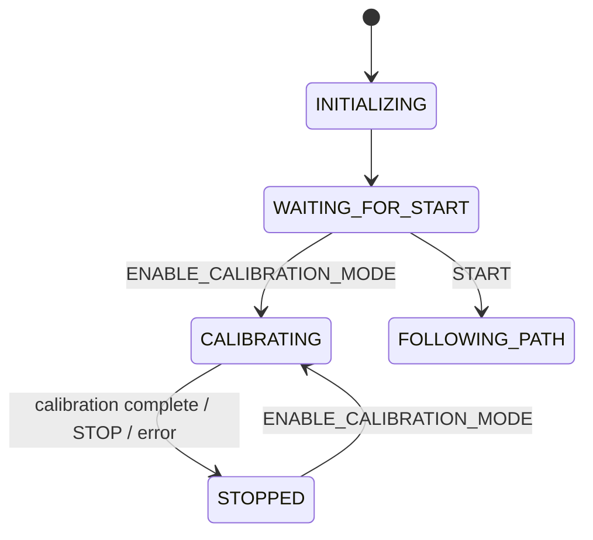

# Active Calibration Integration — Dedicated `CALIBRATING` State

Integrate the three calibration programs (01_throttle_velocity, 03_steering, 05_throttle_acceleration) as an **active calibration state** in the vehicle state machine. The vehicle enters `CALIBRATING` state via a Ground Station command, autonomously executes the selected calibration sequence (throttle staircase, steering sweep, or throttle step transitions), records data, fits models, saves results, and transitions back to `STOPPED`.

## Architecture Overview



The `CalibratingState` takes **full control of the vehicle** (like [ManualModeState](file:///c:/Users/Quang%20Huy%20Nugyen/Desktop/PHD_paper/Simulation/QCAR/QCar2_Cran/Development/multi_vehicle_self_driving_RealQcar/qcar/StateMachine/manual_mode_state.py#35-323)), writing throttle/steering commands directly to hardware. It runs one calibration routine at a time.

---

## Proposed Changes

### Component 1: State Machine Core

---

#### [MODIFY] [vehicle_state.py](file:///c:/Users/Quang%20Huy%20Nugyen/Desktop/PHD_paper/Simulation/QCAR/QCar2_Cran/Development/multi_vehicle_self_driving_RealQcar/qcar/StateMachine/vehicle_state.py)

Add new state and transition reason:
```diff
+    CALIBRATING = auto()       # Active calibration sequences
+    CALIBRATION_COMPLETE = auto()  # (StateTransitionReason)
```

---

#### [NEW] [calibrating_state.py](file:///c:/Users/Quang%20Huy%20Nugyen/Desktop/PHD_paper/Simulation/QCAR/QCar2_Cran/Development/multi_vehicle_self_driving_RealQcar/qcar/StateMachine/calibrating_state.py)

A new state handler that:

1. **[enter()](file:///c:/Users/Quang%20Huy%20Nugyen/Desktop/PHD_paper/Simulation/QCAR/QCar2_Cran/Development/multi_vehicle_self_driving_RealQcar/qcar/StateMachine/stopped_state.py#35-54)**: Reads `calibration_type` from command data (`throttle_velocity`, `steering_curvature`, or `throttle_acceleration`), initializes the calibration sequence parameters (staircase levels, durations, etc.)
2. **[update(dt, sensor_data)](file:///c:/Users/Quang%20Huy%20Nugyen/Desktop/PHD_paper/Simulation/QCAR/QCar2_Cran/Development/multi_vehicle_self_driving_RealQcar/qcar/StateMachine/waiting_for_start_state.py#52-78)**: Non-blocking state machine that advances through calibration phases:
   - **`throttle_velocity`**: Staircase throttle commands → measure steady-state velocity → polynomial fit
   - **`steering_curvature`**: Constant speed + sweep steering → measure yaw rate → Ackermann fit
   - **`throttle_acceleration`**: Step transitions → measure acceleration dynamics → first-order model
   - Writes throttle/steering directly to `qcar.read_write_std()`
   - Records `[time, throttle, steering, velocity, yaw_rate, accel]` each tick
   - When sequence completes → runs analysis → saves results → returns transition to STOPPED
3. **[handle_event()](file:///c:/Users/Quang%20Huy%20Nugyen/Desktop/PHD_paper/Simulation/QCAR/QCar2_Cran/Development/multi_vehicle_self_driving_RealQcar/qcar/StateMachine/manual_mode_state.py#109-222)**: Accepts STOP/EMERGENCY_STOP to abort calibration
4. **[exit()](file:///c:/Users/Quang%20Huy%20Nugyen/Desktop/PHD_paper/Simulation/QCAR/QCar2_Cran/Development/multi_vehicle_self_driving_RealQcar/qcar/StateMachine/state_base.py#78-81)**: Stops vehicle, saves any partial data

Key design: uses a `_phase` variable (`WARMUP`, `RUNNING`, `SETTLING`, `ANALYSING`, `DONE`) and a `_step_index` to track progress through the calibration sequence, checked each [update()](file:///c:/Users/Quang%20Huy%20Nugyen/Desktop/PHD_paper/Simulation/QCAR/QCar2_Cran/Development/multi_vehicle_self_driving_RealQcar/qcar/StateMachine/waiting_for_start_state.py#52-78) call (non-blocking, no `time.sleep()`).

---

#### [MODIFY] [vehicle_state_machine.py](file:///c:/Users/Quang%20Huy%20Nugyen/Desktop/PHD_paper/Simulation/QCAR/QCar2_Cran/Development/multi_vehicle_self_driving_RealQcar/qcar/StateMachine/vehicle_state_machine.py)

- Import `CalibratingState`
- Register in `state_handlers`: `VehicleState.CALIBRATING: CalibratingState(vehicle_logic)`

---

### Component 2: Command Routing

---

#### [MODIFY] [command_types.py](file:///c:/Users/Quang%20Huy%20Nugyen/Desktop/PHD_paper/Simulation/QCAR/QCar2_Cran/Development/multi_vehicle_self_driving_RealQcar/qcar/command_types.py)

```diff
+    ENABLE_CALIBRATION_MODE = "enable_calibration_mode"
```

---

#### [MODIFY] [waiting_for_start_state.py](file:///c:/Users/Quang%20Huy%20Nugyen/Desktop/PHD_paper/Simulation/QCAR/QCar2_Cran/Development/multi_vehicle_self_driving_RealQcar/qcar/StateMachine/waiting_for_start_state.py)

Handle `ENABLE_CALIBRATION_MODE` → store calibration config in `vehicle_logic` → transition to `CALIBRATING`.

---

#### [MODIFY] [stopped_state.py](file:///c:/Users/Quang%20Huy%20Nugyen/Desktop/PHD_paper/Simulation/QCAR/QCar2_Cran/Development/multi_vehicle_self_driving_RealQcar/qcar/StateMachine/stopped_state.py)

Handle `ENABLE_CALIBRATION_MODE` → transition to `CALIBRATING` (same as above).

---

### Component 3: Observer Support

---

#### [MODIFY] [VehicleObserverSimple.py](file:///c:/Users/Quang%20Huy%20Nugyen/Desktop/PHD_paper/Simulation/QCAR/QCar2_Cran/Development/multi_vehicle_self_driving_RealQcar/qcar/Observer/VehicleObserverSimple.py)

Add `get_calibration_sample()` method:
```python
def get_calibration_sample(self) -> Optional[np.ndarray]:
    """[v, throttle, steering, yaw_rate, ax, ay, az]"""
```

---

## Ground Station Command Format

```json
{
  "type": "enable_calibration_mode",
  "calibration_type": "throttle_velocity",
  "params": {
    "throttle_levels": [0.04, 0.06, 0.08, 0.10, 0.12, 0.14],
    "hold_time": 5.0,
    "settle_time": 2.0
  }
}
```

Supported `calibration_type` values:
| Type | Sequence | Output |
|---|---|---|
| `throttle_velocity` | Staircase throttle, measure steady-state v | `throttle_velocity_poly.yaml` |
| `steering_curvature` | Constant speed + steering sweep, measure ω | `steering_calibration.yaml` |
| `throttle_acceleration` | Throttle step transitions, measure dynamics | `throttle_accel_model.yaml` |

---

## Verification Plan

### Structural
```bash
python -c "from StateMachine.calibrating_state import CalibratingState; print('OK')"
python -c "from StateMachine.vehicle_state import VehicleState; print(VehicleState.CALIBRATING)"
```

### Functional (User)
1. Start vehicle system → enter WAITING_FOR_START
2. Send `enable_calibration_mode` with `calibration_type: "throttle_velocity"`
3. Vehicle enters CALIBRATING, executes throttle staircase autonomously
4. Verify results saved to `Calibration/results/`
5. Vehicle returns to STOPPED
