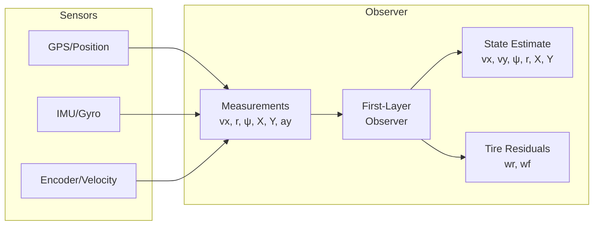

# Local Neural Observers Module

A comprehensive state estimation framework for vehicle dynamics, featuring multiple observer architectures with tire force residual estimation.

## Overview

This module provides **first-layer observers** for the distributed vehicle state estimation pipeline. These observers estimate the vehicle's dynamic state from sensor measurements while also recovering unknown tire force disturbances.



## Key Features

- **qLPV (quasi-Linear Parameter-Varying) dynamics** matching the bicycle model
- **Tire residual estimation** (w_r, w_f) for unknown tire force recovery
- **Multiple observer architectures** with varying complexity/robustness trade-offs
- **EKF dynamic gain computation** for optimal state correction
- **Robust differentiators** for derivative estimation

---

## Observer Architectures

### Recommended: `qLPV_EKF` or `Diff_EKF` (99% convergence)

| Observer | Convergence | Use Case |
|----------|-------------|----------|
| **qLPV_EKF** | 99.3% | Best for augmented-state estimation |
| **Diff_EKF** | 99.2% | Best when derivative info is valuable |
| qLPV_Basic | Diverges | Development/debugging only |
| Diff_UIO | Diverges | Needs manual gain tuning |

### 1. `qlpv_observer_kalma.py` - qLPV + EKF ⭐ Recommended

```python
from qlpv_observer_kalma import create_qlpv_observer

observer = create_qlpv_observer(sample_time=0.02, vehicle_params={
    'lf': 0.11, 'lr': 0.11, 'm': 3.5, 'Iz': 0.05,
    'Cf': 50.0, 'Cr': 50.0, 'mu': 0.01
})

# Update with measurements
measurement = np.array([vx, r, psi, X, Y, ay])
control = np.array([delta, accel])
state_est, w_est = observer.update(measurement, control)
```

**Features:**
- 8D augmented state: `[vx, vy, ψ, r, X, Y, wr, wf]`
- EKF dynamic Kalman gain computation
- Tuned Q/R noise matrices

### 2. `differentiator_uio_ekf.py` - Diff + UIO + EKF ⭐ Recommended

```python
from differentiator_uio_ekf import DifferentiatorUIOEKF

observer = DifferentiatorUIOEKF(sample_time=0.02, diff_type='highgain')
state_est, w_est = observer.update(measurement, control)
```

**Features:**
- HighGain differentiator for ṙ estimation
- UIO-style tire residual estimation
- EKF state correction

### 3. `qlpv_observer.py` - Basic qLPV

Static-gain observer for development/debugging. Not recommended for production.

### 4. `differentiator_uio_observer.py` - UIO with Differentiator

UIO-style observer with configurable differentiators. Requires manual gain tuning.

---

## State Conventions

### Observer State (6D)
```
x = [vx, vy, ψ, r, X, Y]ᵀ
```
- `vx`: Longitudinal velocity [m/s]
- `vy`: Lateral velocity [m/s]
- `ψ`: Yaw angle [rad]
- `r`: Yaw rate [rad/s]
- `X, Y`: Global position [m]

### Measurement (6D)
```
y = [vx, r, ψ, X, Y, ay]ᵀ
```

### Tire Residuals (2D)
```
w = [wr, wf]ᵀ
```
- `wr`: Rear tire force residual [N]
- `wf`: Front tire force residual [N]

---

## Testing

### Run All Integration Tests
```bash
cd qcar/Observer/LocalNeuralObs
python test_observer_vehicle_integration.py
```

### Run Individual Tests
```bash
python test_qlpv_observer.py           # qLPV matrix/dynamics tests
python test_qlpv_observer_kalman.py    # EKF gain computation tests
python test_differentiator_uio_observer.py  # Differentiator tests
```

### Expected Results
```
Observer        Convergence
----------------------------
qLPV_EKF        99.3% ✓
Diff_EKF        99.2% ✓
qLPV_Basic      Diverges ✗
Diff_UIO        Diverges ✗
```

---

## File Reference

| File | Description |
|------|-------------|
| `qlpv_observer_kalma.py` | **⭐ Recommended** - qLPV + EKF observer |
| `differentiator_uio_ekf.py` | **⭐ Recommended** - Diff + UIO + EKF |
| `qlpv_observer.py` | Basic qLPV observer (static gains) |
| `differentiator_uio_observer.py` | UIO with differentiators |
| `firstLayerObserverBase.py` | Base classes for UIO framework |
| `neural_state_estimator.py` | Neural network enhanced estimator |
| `gradient_solver.py` | Gradient-based optimization |
| `neural_network.py` | NN models and training |

---

## Integration with Fleet Estimator

These first-layer observers feed into the distributed fleet estimator:

```python
from qlpv_observer_kalma import create_qlpv_observer
from trust_based_fleet_estimator import TrustBasedFleetEstimator

# Create local observer
local_obs = create_qlpv_observer(sample_time=0.02)

# Integrate with fleet estimator
fleet_est = TrustBasedFleetEstimator(
    vehicle_id=0,
    first_layer_observer=local_obs
)
```

---

## Vehicle Parameters

Key parameters for QCar scale model:

```yaml
lf: 0.11      # CG to front axle [m]
lr: 0.11      # CG to rear axle [m]
m: 3.5        # Mass [kg]
Iz: 0.05      # Yaw inertia [kg·m²]
Cf: 50.0      # Front cornering stiffness [N/rad]
Cr: 50.0      # Rear cornering stiffness [N/rad]
mu: 0.01      # Friction coefficient (load transfer)
```

---

## Authors

Observer Test Framework - HuyKSL PhD Research
