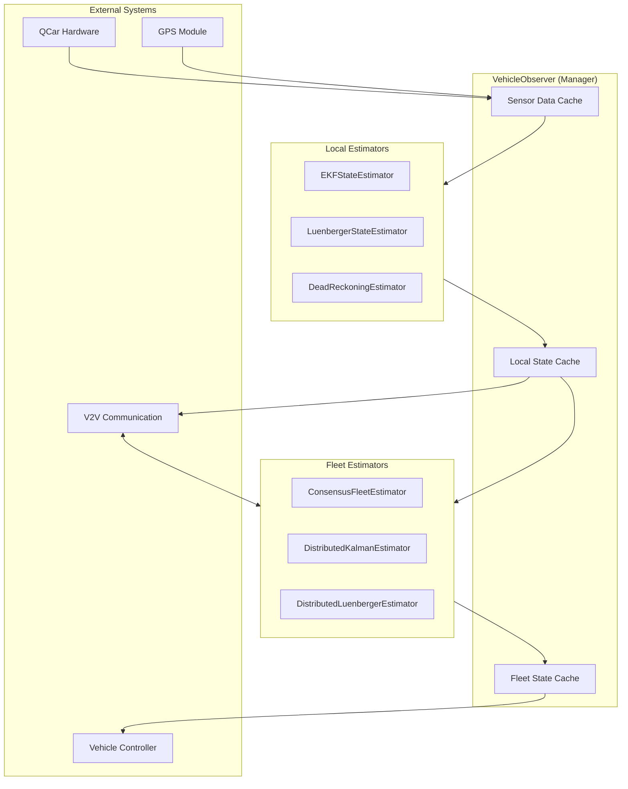
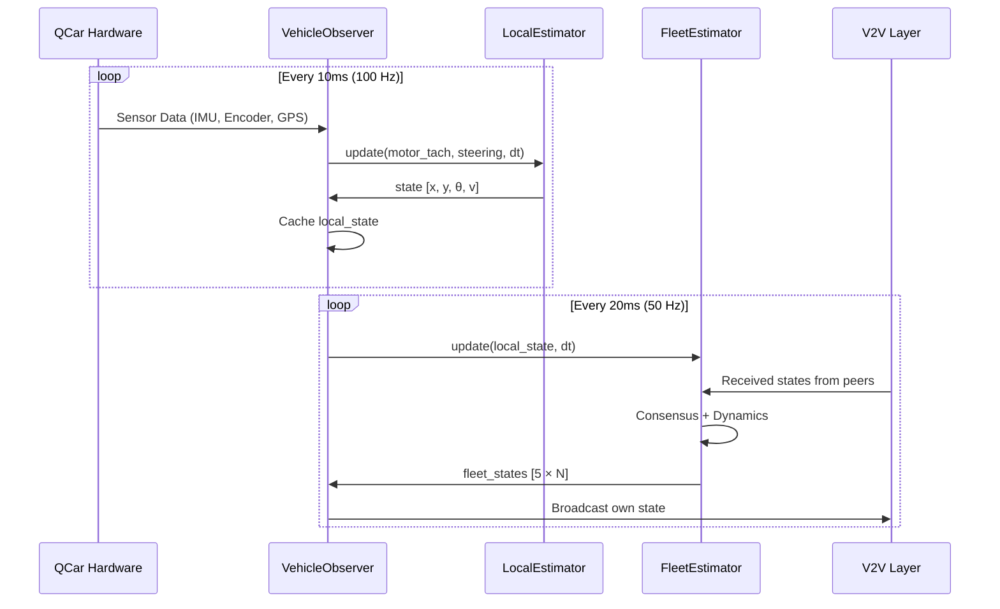
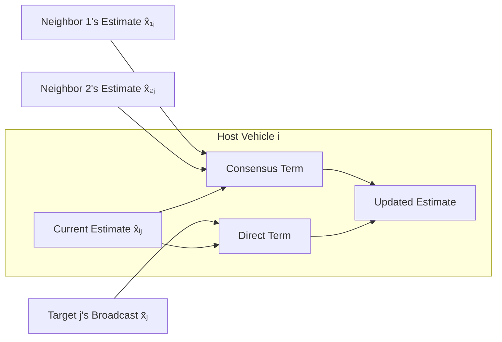

<p align="center">
  <h1 align="center"> Vehicle Observer System</h1>
  <p align="center">
    <strong>A modular, pluggable state estimation framework for multi-vehicle autonomous coordination</strong>
  </p>
  <p align="center">
    <a href="#key-features">Features</a> •
    <a href="#architecture">Architecture</a> •
    <a href="#quickstart">Quickstart</a> •
    <a href="#configuration">Configuration</a> •
    <a href="#api-reference">API</a>
  </p>
</p>

---

## Introduction

The **Vehicle Observer** is a sophisticated state estimation system designed for real-time multi-vehicle coordination. It provides a unified interface for both **local state estimation** (single vehicle) and **distributed fleet estimation** (multi-vehicle consensus).

Built with a **factory pattern** architecture, the system allows seamless switching between estimation algorithms without changing application code—from Extended Kalman Filters to Distributed Consensus estimators.

```
┌─────────────────────────────────────────────────────────────────┐
│                     Vehicle Observer System                      │
├─────────────────────────────────────────────────────────────────┤
│  ┌─────────────────┐        ┌─────────────────────────────────┐ │
│  │ Local Estimator │        │    Fleet Estimator (Distributed)│ │
│  │   • EKF         │        │      • Consensus                │ │
│  │   • Luenberger  │   ⟷    │      • Distributed Kalman       │ │
│  │   • Dead Reckon │        │      • Distributed Luenberger   │ │
│  └─────────────────┘        └─────────────────────────────────┘ │
│            ▲                              ▲                      │
│            │    Unified API               │                      │
│            └──────────┬───────────────────┘                      │
│                       ▼                                          │
│              ┌────────────────┐                                  │
│              │ VehicleObserver│  ← Manager & Coordinator         │
│              │    (Manager)   │                                  │
│              └────────────────┘                                  │
└─────────────────────────────────────────────────────────────────┘
```

---

## Key Features

### 🔌 Pluggable Architecture
Swap between estimation algorithms at runtime using factory-based instantiation. No code changes required when switching from EKF to Luenberger or from Consensus to Distributed Kalman.

### 🚗 Local State Estimation
High-frequency (100 Hz) local state estimation using:
- **Extended Kalman Filter (EKF)** — Optimal fusion of GPS, IMU, and odometry
- **Luenberger Observer** — Deterministic observer with tunable gains
- **Dead Reckoning** — Fallback when GPS is unavailable

### 🚛 Distributed Fleet Estimation
Lower-frequency (50 Hz) consensus-based estimation across the vehicle fleet:
- **Consensus Estimator** — Simple, robust averaging with direct measurement fusion
- **Distributed Kalman** — Model-based prediction with consensus correction
- **Distributed Luenberger** — Longitudinal platoon estimation with vehicle dynamics

### 📡 V2V Integration
Seamless integration with Vehicle-to-Vehicle communication:
- Automatic fleet size discovery and expansion
- Timestamped state broadcasts (local + fleet)
- Age-based validity checking for received data

### 🧵 Thread-Safe Design
Full thread safety with `RLock` protection for all shared state access.

---

## Architecture

### Module Structure

```
Observer/
├── VehicleObserverSimple.py       # Manager class - coordinates all estimators
├── local_state_estimators.py      # Pluggable local estimators (EKF, Luenberger, Dead Reckoning)
├── fleet_state_estimators.py      # Pluggable fleet estimators (Consensus, Distributed Kalman)
├── config_local_estimators.yaml   # Configuration for local estimators
├── config_fleet_estimators.yaml   # Configuration for fleet estimators
└── __init__.py                    # Package initialization
```

### Component Diagram



### Data Flow



---

## Quickstart

### Basic Usage

```python
from Observer.VehicleObserverSimple import VehicleObserver

# Initialize observer
observer = VehicleObserver(
    vehicle_id=0,
    config=config,
    logger=logger,
    local_estimator_type='ekf',      # 'ekf', 'luenberger', or 'dead_reckoning'
    fleet_estimator_type='consensus' # 'consensus' or 'distributed_kalman'
)

# Initialize local estimator with GPS
observer.initialize_local_estimator(
    gps=gps_instance,
    initial_pose=[0.0, 0.0, 0.0]  # [x, y, theta]
)

# Main control loop
while running:
    # 1. Read sensors (centralized)
    observer.update_sensor_data(qcar)
    
    # 2. Update observer
    state_info = observer.update_observer(
        dt=0.01,
        last_steering=steering_cmd,
        throttle=throttle_cmd
    )
    
    # 3. Use state for control
    x, y, theta = state_info['x'], state_info['y'], state_info['theta']
    velocity = state_info['velocity']
```

### V2V Integration

```python
# When V2V activates, reinitialize fleet estimation
def on_v2v_activated(peer_ids: List[int]):
    fleet_size = len(peer_ids) + 1  # Include self
    observer.reinitialize_fleet_estimation(fleet_size, peer_ids)

# Handle received local state broadcasts
def on_local_state_received(sender_id: int, state: dict, timestamp_ns: int):
    observer.add_received_local_state(sender_id, state, timestamp_ns)

# Handle received fleet state broadcasts
def on_fleet_state_received(sender_id: int, fleet_estimates: dict, timestamp_ns: int):
    observer.add_received_fleet_state(sender_id, fleet_estimates, timestamp_ns)

# Get data for broadcasting
local_broadcast = observer.get_local_state_for_broadcast()
fleet_broadcast = observer.get_fleet_state_for_broadcast()
```

---

## State Vector Definition

The system uses a **5-dimensional state vector**:

| Index | Symbol | Description | Unit |
|-------|--------|-------------|------|
| 0 | `x` | Position X | meters |
| 1 | `y` | Position Y | meters |
| 2 | `θ` | Heading angle | radians |
| 3 | `v` | Velocity | m/s |
| 4 | `a` | Acceleration | m/s² |

> [!NOTE]
> Some estimators (legacy) use a 4D state without acceleration. The manager automatically handles dimension conversion.

---

## Configuration

### Local Estimator Configuration

**File:** `config_local_estimators.yaml`

```yaml
local_estimator_type: ekf

local:
  ekf:
    use_qcar_ekf: true  # Use hardware-optimized EKF
  
  luenberger:
    observer_gain: 0.5  # Higher = more aggressive correction
  
  dead_reckoning: {}    # No parameters needed
```

### Fleet Estimator Configuration

**File:** `config_fleet_estimators.yaml`

```yaml
fleet_estimator_type: consensus

fleet:
  state_dim: 5
  max_state_age_ns: 1000000000  # 1 second validity window
  fleet_observer_rate: 50       # Hz
  
  consensus:
    consensus_gain: 0.3   # Weight for neighbor estimates
    direct_gain: 0.7      # Weight for direct broadcasts
  
  distributed_kalman:
    observer_gain: 0.1
    consensus_gain: 0.2
    process_noise: 0.01
    measurement_noise: 0.1
  
  distributed_luenberger:
    state_dim: 3          # Longitudinal only
    observer_gain: 0.1
    consensus_gain: 0.2
    # Vehicle dynamics parameters
    m_i: 0.5              # Mass (kg)
    tau_i: 0.16           # Time constant
```

---

## Estimator Algorithms

### Local Estimators

#### Extended Kalman Filter (EKF)

The EKF provides optimal state estimation by fusing GPS measurements with a bicycle kinematic model.

**Prediction Step:**
```
x̂⁻ₖ = f(x̂ₖ₋₁, uₖ₋₁)
P⁻ₖ = FₖPₖ₋₁Fₖᵀ + Q
```

**Update Step (when GPS available):**
```
Kₖ = P⁻ₖHᵀ(HP⁻ₖHᵀ + R)⁻¹
x̂ₖ = x̂⁻ₖ + Kₖ(zₖ - Hx̂⁻ₖ)
Pₖ = (I - KₖH)P⁻ₖ
```

#### Luenberger Observer

A deterministic observer with tunable gain matrix L:

```
x̂ₖ = Ax̂ₖ₋₁ + Buₖ₋₁ + L(yₖ - Cx̂ₖ)
```

#### Dead Reckoning

Pure integration from odometry when no GPS is available:

```
xₖ = xₖ₋₁ + vₖ₋₁ · cos(θₖ₋₁) · Δt
yₖ = yₖ₋₁ + vₖ₋₁ · sin(θₖ₋₁) · Δt
θₖ = θₖ₋₁ + ωz · Δt
```

---

### Fleet Estimators

#### Consensus Fleet Estimator

Combines **neighbor consensus** with **direct measurement correction**:

```
x̂ᵢⱼ(k+1) = x̂ᵢⱼ(k) + kc · Σₙ(x̂ₙⱼ - x̂ᵢⱼ)/N + kd · (x̄ⱼ - x̂ᵢⱼ)
```

Where:
- `x̂ᵢⱼ` = Vehicle i's estimate of vehicle j
- `kc` = Consensus gain (default: 0.3)
- `kd` = Direct measurement gain (default: 0.7)
- `x̄ⱼ` = Direct broadcast from vehicle j



#### Distributed Kalman Estimator

Adds **dynamics prediction** to the consensus framework:

```
x̂ᵢⱼ(k+1) = f(x̂ᵢⱼ(k), uⱼ) + L(x̄ⱼ - f(x̂ᵢⱼ, uⱼ)) + Consensus
```

Uses bicycle model for prediction:
```python
x_pred = x + v * cos(θ) * dt
y_pred = y + v * sin(θ) * dt
θ_pred = θ + v * tan(δ) / L * dt
v_pred = v + throttle * dt
```

#### Distributed Luenberger Estimator

Specialized for **longitudinal platoon control** with nonlinear vehicle dynamics:

```
ẋ = Ax + Bφ(v, a)
```

Where φ(v, a) includes aerodynamic drag and rolling resistance:

```
φᵢ(vᵢ, aᵢ) = -(ρCdAF)/(2mτ)(v² + 2τva) - a/τ + μg/τ
```

---

## API Reference

### VehicleObserver (Manager Class)

| Method | Description | Returns |
|--------|-------------|---------|
| `update_sensor_data(qcar)` | Read all sensors from QCar | `bool` |
| `update_observer(dt, steering, throttle)` | Run estimation cycle | `dict` |
| `get_local_state()` | Get local state as numpy array | `np.ndarray [5]` |
| `get_fleet_states()` | Get all fleet states | `np.ndarray [5×N]` |
| `get_vehicle_state(id)` | Get specific vehicle state | `np.ndarray [5]` |
| `get_local_state_for_broadcast()` | Format for V2V local broadcast | `dict` |
| `get_fleet_state_for_broadcast()` | Format for V2V fleet broadcast | `dict` |
| `add_received_local_state(...)` | Process incoming local state | `bool` |
| `add_received_fleet_state(...)` | Process incoming fleet state | `bool` |
| `reinitialize_fleet_estimation(...)` | Reconfigure when V2V activates | `None` |
| `reset_observer(initial_pose)` | Reset all state | `None` |

### Factory Classes

```python
# Create local estimator
from Observer.local_state_estimators import LocalEstimatorFactory

estimator = LocalEstimatorFactory.create(
    estimator_type='ekf',           # or 'luenberger', 'dead_reckoning'
    initial_pose=np.array([0, 0, 0]),
    logger=logger,
    config={'use_qcar_ekf': True}
)

# Create fleet estimator
from Observer.fleet_state_estimators import FleetEstimatorFactory

fleet_est = FleetEstimatorFactory.create(
    estimator_type='consensus',     # or 'distributed_kalman', 'distributed_luenberger'
    vehicle_id=0,
    fleet_size=3,
    state_dim=5,
    config={'consensus_gain': 0.3},
    logger=logger
)
```

---

## Performance Characteristics

| Metric | Local Estimator | Fleet Estimator |
|--------|-----------------|-----------------|
| **Update Rate** | 100 Hz | 50 Hz |
| **Latency** | < 1 ms | < 5 ms |
| **Memory** | ~1 KB per vehicle | ~5 KB per fleet |
| **State Age Validity** | — | 1.0 second |

### Auto-Expansion

The fleet estimator automatically expands capacity when new vehicles are discovered:

```python
# When vehicle_id >= current_fleet_size:
#   1. Expand fleet_states array
#   2. Update weight arrays (for Distributed Kalman)
#   3. Log the expansion
```

---

## Troubleshooting

### GPS Signal Loss

> [!TIP]
> The system automatically falls back to dead reckoning when GPS is unavailable. State validity flag (`gps_valid`) will be `False`.

### Fleet State Divergence

> [!WARNING]
> If fleet states diverge significantly, check:
> 1. V2V communication health
> 2. Timestamp synchronization across vehicles
> 3. Consensus gain tuning (lower gains = more stable but slower convergence)

### Estimator Not Initialized

```python
# Common error: Local estimator not initialized
# Solution: Call initialize_local_estimator() before update_observer()
observer.initialize_local_estimator(gps=gps, initial_pose=[0, 0, 0])
```

---

## Related Documentation

- [Architecture Diagram](../ARCHITECTURE_DIAGRAM.md) — Full system overview
- [V2V Communication](../V2V/README.md) — Vehicle-to-Vehicle integration
- [Controller](../Controller/README.md) — Control system using observer data

---

<p align="center">
  <sub>Built with ❤️ for the QCar Multi-Vehicle Research Project</sub>
</p>
