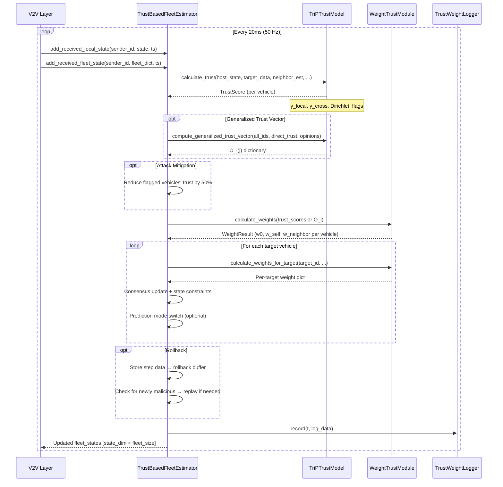

# 🛡️ Trust-Based Distributed Fleet Estimator

> **A robust, trust-aware distributed state estimation framework for multi-vehicle coordination in adversarial environments — built on the TriP Trust Model, adaptive consensus weights, Dirichlet trust-level fusion, and contamination rollback.**

[](https://python.org)
[](.)
[](.)

---

## 📋 Table of Contents

- [Introduction](#-introduction)
- [Key Features](#-key-features)
- [Architecture Overview](#-architecture-overview)
- [System Pipeline](#-system-pipeline)
- [Module Reference](#-module-reference)
  - [TriP Trust Model](#1-trip-trust-model--trust_modelpy)
  - [Weight Trust Module](#2-weight-trust-module--weight_trust_modulepy)
  - [Trust-Based Fleet Estimator](#3-trust-based-fleet-estimator--trust_based_fleet_estimatorpy)
  - [Trust Weight Logger](#4-trust-weight-logger--trust_loggerpy)
- [Configuration Guide](#-configuration-guide)
- [Quick Start](#-quick-start)
- [API Reference](#-api-reference)
- [Attack Detection & Mitigation](#-attack-detection--mitigation)
- [Advanced Features](#-advanced-features)
- [Logging & Visualization](#-logging--visualization)
- [References](#-references)

---

## 🎯 Introduction

In a cooperative vehicle platoon, each vehicle broadcasts its local state (position, velocity, heading, etc.) over V2V links and receives state estimates from its neighbors. Classical consensus-based distributed observers assume all participants are benign. In practice, a vehicle may be compromised, a sensor may fail, or a communication channel may be unreliable. This module addresses those challenges.

The **Trust-Based Distributed Fleet Estimator** adds a trust evaluation and adaptive weighting layer on top of consensus-based state estimation. Before a neighbor's data is fused into the host vehicle's fleet estimate, the system:

1. **Evaluates trustworthiness** of every neighbor through multi-component scoring (velocity, distance, acceleration, heading, beacon, quality).
2. **Computes adaptive consensus weights** proportional to trust, with hard influence caps and EMA smoothing.
3. **Detects and mitigates attacks** automatically by flagging inconsistent behavior and reducing the influence of suspicious vehicles.
4. **Rolls back contaminated estimates** when a previously trusted vehicle is newly detected as malicious.

### Research Context

This implementation is part of the QCar Multi-Vehicle Research Project and supports research in:

| Area | Relevance |
|------|-----------|
| **Attack-Resilient Platooning** | Trust-weighted consensus rejects Byzantine inputs |
| **Trust Management in V2V Networks** | TriP model + Dirichlet levels for principled trust evolution |
| **CACC (Cooperative Adaptive Cruise Control)** | Fleet state estimation feeds longitudinal/lateral controllers |
| **Distributed Consensus Algorithms** | Weighted consensus with virtual graph and influence capping |

---

## ✨ Key Features

| Feature | Description |
|---------|-------------|
| **Multi-Component Trust (TriP Model)** | Velocity, distance, acceleration, heading, beacon reception, and communication quality — each scored independently |
| **Dual Dirichlet Trust Levels** | 5-level probabilistic trust rating updated from both local observations (γ_local) and distributed cross-validation (γ_cross) |
| **Adaptive Consensus Weights** | Four weight strategies: `equal`, `trust_based` (fixed w0/w_self + trust-proportional neighbors), `graph_based`, and `paper` (bounded LN-set normalization) |
| **Influence Capping** | No single neighbor can exceed a configurable weight cap (default 40%) |
| **EMA Smoothing** | Temporal stability for both trust scores and consensus weights |
| **Generalized Trust Vector O_i(j)** | Multi-hop trust propagation via weighted median aggregation of neighbor opinions |
| **Prediction-Only Mode** | MATLAB-parity switching: when normal estimates diverge too much from dynamics prediction, the system isolates suspicious data by relying on dynamics alone |
| **Contamination Rollback** | When a vehicle is newly flagged as malicious, the system replays the last N steps while excluding that vehicle's contributions |
| **Physical & Temporal Validation** | Optional kinematic plausibility gates (max velocity, acceleration, jerk) and one-step motion-prediction consistency checks |
| **Trust Decay on Packet Loss** | Local and global trust decay separately with configurable λ when beacons are missed, with a minimum floor to prevent irreversible collapse |
| **Self-Belief** | Aggregated estimation confidence metric across all targets, used for system-level health monitoring |
| **Non-Blocking CSV Logger** | Dedicated `TrustWeightLogger` writes per-vehicle trust/weight/estimation data to CSV in a background thread |
| **Pluggable Architecture** | Drop-in replacement for other fleet estimators via `FleetStateEstimatorBase` inheritance |

---

## 🏗️ Architecture Overview

### Module Structure

```
TrustbasedDistributedObserver/
├── __init__.py                       # Package exports
├── trust_model.py                    # TriP Trust Model — multi-component trust evaluation
├── weight_trust_module.py            # Adaptive consensus weight calculation
├── trust_based_fleet_estimator.py    # Main fleet estimator (consensus + Kalman variants)
├── trust_logger.py                   # Non-blocking CSV trust/weight logger
├── plot_trust_data.py                # Post-run visualization utilities
├── inspect_csv.py                    # CSV inspection helper
├── config_trust_estimator.yaml       # Full configuration file
├── _qcar_projet_olds/               # Original MATLAB implementations (reference)
│   ├── TriPTrustModel.m
│   ├── Observer.m
│   ├── Vehicle.m
│   └── Config.m
├── Distributed_Obs_2025_Huy_Shengya.pdf  # Research paper / documentation
├── ch5_main.tex                      # LaTeX chapter source
└── README.md                         # This file
```

### Component Diagram

```
┌──────────────────────────────────────────────────────────────────────────────┐
│                   Trust-Based Distributed Fleet Estimator                    │
│                                                                              │
│  ┌──────────────────────┐       ┌──────────────────────────┐                │
│  │  TriP Trust Model    │──────▶│  Weight Trust Module      │                │
│  │  (trust_model.py)    │       │  (weight_trust_module.py) │                │
│  │                      │       │                            │                │
│  │  Inputs:             │       │  Modes:                    │                │
│  │  • host_state        │       │  • equal                   │                │
│  │  • target_data (V2V) │       │  • trust_based (default)   │                │
│  │  • neighbor_estimates│       │  • graph_based             │                │
│  │  • host_target_est   │       │  • paper (research)        │                │
│  │                      │       │                            │                │
│  │  Outputs:            │       │  Steps:                    │                │
│  │  • TrustScore        │       │  1. Fixed w0, w_self       │                │
│  │  • γ_local           │       │  2. Budget = 1 - w0 - self │                │
│  │  • γ_cross / DT      │       │  3. Trust-proportional     │                │
│  │  • Attack Flags      │       │  4. Influence cap          │                │
│  │  • O_i(j) vector     │       │  5. EMA smoothing          │                │
│  └──────────┬───────────┘       └────────────┬───────────────┘                │
│             │ trust_scores                   │ WeightResult                   │
│             │ + generalized O_i(j)           │ (w0, w_self, w_N per target)   │
│             ▼                                ▼                                │
│  ┌────────────────────────────────────────────────────────────────────────┐   │
│  │        Trust-Based Fleet Estimator  (trust_based_fleet_estimator.py)   │   │
│  │                                                                        │   │
│  │  Per-target update equation:                                           │   │
│  │                                                                        │   │
│  │    x̂_new(T) = x̂_old(T)                                               │   │
│  │              + w0 · (T_broadcast − x̂_old(T))        [direct meas.]    │   │
│  │              + Σ w_N · (N_estimate(T) − x̂_old(T))   [neighbor cons.]  │   │
│  │              + L · (dynamics_pred − x̂_old(T))        [if no direct]    │   │
│  │                                                                        │   │
│  │  Additional stages:                                                    │   │
│  │  • Prediction-only mode switch  (MATLAB-parity)                        │   │
│  │  • Contamination rollback       (trust-triggered replay)               │   │
│  │  • State constraints            (angle wrap, velocity/accel clamp)     │   │
│  │  • Self-belief computation      (mean estimation confidence)           │   │
│  └────────────────────────────────────────────────────────────────────────┘   │
│             │                                                                 │
│             ▼                                                                 │
│  ┌────────────────────────────────────────────────────────────────────────┐   │
│  │        Trust Weight Logger  (trust_logger.py)                          │   │
│  │                                                                        │   │
│  │  • Non-blocking background thread                                      │   │
│  │  • Per-vehicle CSV: trust scores, weights, fleet estimates, flags      │   │
│  │  • Aggregate statistics: mean trust, confidence, prediction mode       │   │
│  └────────────────────────────────────────────────────────────────────────┘   │
└──────────────────────────────────────────────────────────────────────────────┘
```

---

## 🔄 System Pipeline

Below is the **step-by-step pipeline** executed on every update cycle (typically 50 Hz). Understanding this pipeline is essential for tuning and debugging.

### Pipeline Stages

```mermaid
flowchart TD
    subgraph "1 — Input Collection"
        A1[V2V: add_received_local_state<br/>sender broadcasts its own state]
        A2[V2V: add_received_fleet_state<br/>sender shares its fleet estimates]
    end

    subgraph "2 — Trust Evaluation"
        B1["For each known vehicle:<br/>Retrieve latest packet"]
        B2["TriPTrustModel.calculate_trust()<br/>→ TrustScore per vehicle"]
        B3["Compute component scores:<br/>velocity, distance, accel,<br/>heading, beacon, quality"]
        B4["Compute γ_local<br/>(weighted geometric mean)"]
        B5["Compute γ_cross / DT<br/>(paper: γ_host · γ_local · γ_self<br/>legacy: neighbor average)"]
        B6["Update Dirichlet trust levels<br/>(5-level distribution)"]
        B7["Compute final_score<br/>from trust distribution"]
        B8["Apply EMA smoothing<br/>and sudden-change β factor"]
        B9["Set attack flags"]
    end

    subgraph "3 — Trust Vector"
        C1{"use_generalized_<br/>trust_vector?"}
        C2["Build O_i(j) from direct trust<br/>+ weighted median of neighbor opinions"]
        C3["Use direct trust_scores<br/>as O_i(j)"]
    end

    subgraph "4 — Attack Mitigation"
        D1{"attack_mitigation<br/>enabled?"}
        D2["Reduce trust of flagged<br/>vehicles by 50%"]
    end

    subgraph "5 — Weight Calculation"
        E1["WeightTrustModule.calculate_weights()<br/>dispatches to mode:<br/>equal | trust_based | graph_based | paper"]
        E2["Per-target: calculate_weights_for_target()<br/>or calculate_paper_weights_for_target()"]
    end

    subgraph "6 — Consensus Update"
        F1["For each target vehicle T:"]
        F2["Direct correction:<br/>w0 · (T_broadcast − x̂_old)"]
        F3["Neighbor consensus:<br/>Σ w_N · (N_est(T) − x̂_old)"]
        F4["Dynamics fallback (if no direct):<br/>L · (dynamics_pred − x̂_old)"]
        F5["x̂_new = x̂_old + total_correction"]
        F6["Apply state constraints"]
    end

    subgraph "7 — Prediction Mode"
        G1{"use_predict_observer?"}
        G2["Compare normal_est vs dynamics_pred<br/>against similarity_tolerances"]
        G3["Switch to prediction-only mode<br/>if normal est diverges too much<br/>(isolate suspicious V2V data)"]
        G4["Blend or use prediction-only<br/>depending on divergence severity"]
    end

    subgraph "8 — Rollback"
        H1{"rollback_enabled?"}
        H2["Store per-step contributions<br/>in rolling buffer"]
        H3{"Newly malicious<br/>vehicle detected?"}
        H4["Replay buffer while excluding<br/>malicious vehicle's contributions"]
    end

    subgraph "9 — Logging"
        I1["TrustWeightLogger.record()<br/>→ trust_weight_log_Vx.csv"]
    end

    A1 --> B1
    A2 --> B1
    B1 --> B2
    B2 --> B3 --> B4 --> B5 --> B6 --> B7 --> B8 --> B9
    B9 --> C1
    C1 -->|yes| C2
    C1 -->|no| C3
    C2 --> D1
    C3 --> D1
    D1 -->|yes| D2 --> E1
    D1 -->|no| E1
    E1 --> E2 --> F1
    F1 --> F2 --> F3 --> F4 --> F5 --> F6
    F6 --> G1
    G1 -->|yes| G2 --> G3 --> G4
    G1 -->|no| H1
    G4 --> H1
    H1 -->|yes| H2 --> H3
    H3 -->|yes| H4 --> I1
    H3 -->|no| I1
    H1 -->|no| I1
```



### Data Flow (Sequence)



---

## 📦 Module Reference

### 1. TriP Trust Model — `trust_model.py`

The **TriP (Trust-based Intelligent Platoon)** model is the core trust evaluation engine. It assigns a trust score to each neighboring vehicle based on how consistent its reported state is with physical expectations and with what other neighbors report.

#### Data Structures

| Structure | Purpose |
|-----------|---------|
| `TrustConfig` | Dataclass holding all trust model parameters (weights, thresholds, decay, gates, etc.) |
| `VehicleData` | Received vehicle state: `x, y, theta, velocity, acceleration, timestamp_ns` |
| `TrustScore` | Output per vehicle: component scores, γ_local, γ_cross, trust_levels, final_score, attack flags |

#### Trust Component Scores

Each component produces a score in [0, 1]. Higher is more trustworthy.

| Component | What It Measures | Formula | Key Parameters |
|-----------|------------------|---------|----------------|
| **Velocity** | Consistency of target velocity vs reference (host or leader) | `max(1 - |v_target - v_ref| / tolerance, 0)^w_v` | `weight_velocity`, `velocity_tolerance`, `stationary_velocity_threshold` |
| **Distance** | Expected vs actual distance change from relative velocity | `max(1 - |d_actual - d_expected| / d_measured, 0)^w_d` | `weight_distance` |
| **Acceleration** | Reported accel vs estimated accel from velocity difference | `max(1 - |a_error| / norm_factor, 0)^w_a` | `weight_acceleration` |
| **Heading** | Reported heading vs trajectory-estimated heading from position delta | `max(1 - |θ_diff| / θ_max, 0)` | `weight_heading` |
| **Beacon** | Whether a beacon was received within expected interval (binary) | `1.0 if age ≤ 3 × expected_interval, else 0.0` | `expected_beacon_interval_s` |
| **Quality** | Communication quality from message age, drop rate, covariance | `exp(-2 · age) · (1 - drop_rate) · 1/(1 + 0.2 · cov)` | `max_message_age_s`, `use_message_age_quality` |

**Special handling for stationary vehicles:** When both host and target are below `stationary_velocity_threshold` (default 0.2 m/s), velocity and acceleration scores use relaxed tolerances to avoid penalizing sensor noise at rest.

#### Optional Validation Gates

These optional gates apply multiplicative penalties to trust component scores when violated:

| Gate | Config Flag | What It Checks |
|------|-------------|----------------|
| **Physical Constraints** | `use_physical_constraints_check` | `|v| ≤ max_velocity`, `a ∈ [max_deceleration, max_acceleration]`, jerk ≤ `max_jerk` |
| **Temporal Consistency** | `use_temporal_consistency_check` | One-step motion-prediction error in position and velocity vs tolerances |

When a gate fails, the relevant component scores are multiplied by 0.1 (physical) or a continuous degradation factor (temporal).

#### Local Trust Sample (`γ_local`)

A **weighted geometric mean** of all component scores:

```
γ_local = ∏(score_i ^ w_i) ^ (1 / Σw_i)
```

Default weights: velocity=0.3, distance=0.2, acceleration=0.15, heading=0.15, beacon=0.1, quality=0.1

Each score is floored at 0.01 to ensure that a zero score degrades — but doesn't destroy — the geometric mean.

#### Global Trust Sample (`γ_cross`) — Distributed Trust

Two modes are supported:

| Mode | Formula | When to Use |
|------|---------|-------------|
| **`legacy`** | Average of neighbor trust reports about the target | Simple setups, no distributed estimates exchanged |
| **`paper`** | `DT = γ_host × γ_local_neighbors × γ_self` using Mahalanobis consistency | Research-grade, requires neighbors to share fleet estimates |

**Paper-mode details:**
- `γ_self`: `exp(-d_Mahal(host_estimate, target_broadcast))` — does the host's own estimate of the target agree with what the target reports?
- `γ_host`: `exp(-mean(d_Mahal(host_estimate, neighbor_estimate)))` — do neighbors agree with the host's estimate?
- `γ_local_neighbors`: `exp(-mean(d_Mahal(target_broadcast, neighbor_estimate)))` — do neighbors agree with the target's direct packet?

The Mahalanobis distance uses a configurable diagonal covariance (`distributed_trust_covariance_diag`).

**Fallback for small fleets:** When no neighbor estimates are available (e.g., 2-vehicle fleet), the system blends `γ_self` with a `distributed_trust_fallback` value (0.6γ_self + 0.4·fallback) to prevent runaway decay.

#### Trust Decay

When beacons are missed, local and global trust decay independently:

```
T(t) = (1 - λ) · T(t-1)    (if no beacon received)
```

A minimum floor (`max(fallback * 0.1, 0.01)`) prevents trust from collapsing to near-zero and never recovering.

#### Dirichlet Trust Levels

Trust is maintained as a **5-level probability distribution**:

| Level | Name | Value Range | Symbol |
|-------|------|-------------|--------|
| 1 | Untrusted | 0.0 – 0.2 | 🔴 |
| 2 | Suspicious | 0.2 – 0.4 | 🟠 |
| 3 | Neutral | 0.4 – 0.6 | 🟡 |
| 4 | Trusted | 0.6 – 0.8 | 🟢 |
| 5 | Highly Trusted | 0.8 – 1.0 | 🔵 |

**Update rule:**
- In **Dual** mode: `combined_sample = γ_local × γ_cross` (paper) or `0.6·γ_local + 0.4·γ_cross` (legacy)
- In **Single** mode: `combined_sample = γ_local`
- Map sample to level index, create one-hot update vector
- EMA blend with previous distribution: `new = (1 - rate) × old + rate × one_hot`
- Normalize to sum=1

**Final score** = weighted sum: `Σ level_probability × level_value` where level values are `[0.1, 0.3, 0.5, 0.7, 0.9]`.

#### Sudden-Change Monitoring

When enabled (`monitor_sudden_change: true`), a z-score test on the trust history detects abrupt changes. If the z-score exceeds `sudden_change_threshold`, a multiplicative `β < 1` is applied to the final score to moderate the impact.

#### Generalized Trust Vector O_i(j)

When `use_generalized_trust_vector: true`, the model builds a generalized trust vector from:

1. **Direct neighbors**: `O_i(j) = VT_i,j` (direct trust score)
2. **Non-direct vehicles with credible reports**: Weighted median aggregation from trusted neighbors' opinions
3. **Fallback**: Index-distance weighted average over direct neighbors' propagated opinions

This vector is used by the **paper weight mode** to determine legitimate neighbor sets.

---

### 2. Weight Trust Module — `weight_trust_module.py`

Converts trust scores into **row-stochastic consensus weights** for the distributed observer update equation.

#### Weight Strategies

| Strategy | Key | Description |
|----------|-----|-------------|
| **Equal** | `equal` | All trusted neighbors get `w = 1/n`. Virtual node (w0) included. Self weight = 0. |
| **Trust-Based** | `trust_based` | Fixed `w0` + `w_self`, remaining budget distributed proportional to trust. Influence cap per neighbor. |
| **Graph-Based** | `graph_based` | Uses adjacency matrix for neighbor discovery. Virtual graph with extra node for local measurement. |
| **Paper** | `paper` | Bounded normalization: `LN_i^(j)` = legitimate neighbors for target j. `n = max(κ, |LN| + 1)`. `w = 1/n` for legitimates, residual to self. |

#### Trust-Based Weight Algorithm (Default)

```
Step 1: Fixed allocations
    w0 = 0.3             (direct measurement from target)
    w_self = 0.2         (persistence of own previous estimate)

Step 2: Neighbor budget
    budget = 1.0 - w0 - w_self = 0.5

Step 3: Get trusted neighbors
    trusted = {N | trust(N) ≥ trust_threshold}
    Sort by trust (descending), limit to κ neighbors

Step 4: Trust-proportional distribution
    For each trusted neighbor N:
        w_raw(N) = (trust(N) / Σtrust) × budget
        w(N) = min(w_raw(N), w_cap)      ← influence cap

Step 5: Redistribute excess
    If budget not fully used → add to w_self

Step 6: Normalize to sum = 1.0

Step 7: EMA smoothing (if enabled)
    w_new = η · w_computed + (1 - η) · w_previous
    Re-normalize
```

#### Paper Weight Algorithm (Per-Target)

For estimating target vehicle `j`:

```
1. Build candidate set: neighbors who provide estimates for target j
2. Filter to legitimate set: LN_i^(j) = {l ∈ candidates | O_i(l) ≥ θ_min}
3. Include anchor (direct measurement): only if LT_i,j ≥ θ_min AND measurement exists
4. Calculate n = max(κ, |LN_i^(j)| + 1)
5. Each legitimate gets w = 1/n
6. Residual goes to self: w_self = 1 - used
```

#### Key Parameters

| Parameter | Default | Role |
|-----------|---------|------|
| `w0_fixed` | 0.3 | Weight for target's own broadcast (direct measurement) |
| `w_self_base` | 0.2 | Persistence weight for host's own previous estimate |
| `w_cap` | 0.4 | Maximum weight any single neighbor can receive (40%) |
| `kappa` (κ) | 5 | Maximum number of neighbors considered in consensus |
| `eta` (η) | 0.15 | EMA smoothing factor for temporal weight stability |
| `trust_threshold` | 0.5 | Minimum trust to be considered a trusted neighbor |

---

### 3. Trust-Based Fleet Estimator — `trust_based_fleet_estimator.py`

The **main orchestrator** that ties trust evaluation, weight calculation, and distributed state estimation together. Two classes are provided:

#### `TrustBasedFleetEstimator` (Consensus)

Inherits from `FleetStateEstimatorBase`. On each `update()` call:

1. Set own state in `fleet_states[:, self.vehicle_id]`
2. Evaluate trust for all known vehicles → `Dict[int, float]`
3. Optionally apply attack mitigation (halve trust of flagged vehicles)
4. Build generalized trust vector O_i(j) if configured
5. Calculate global weights (for logging) and per-target weights
6. For each target vehicle:
   - Compute direct measurement correction: `w0 × (broadcast − current_est)`
   - Compute neighbor corrections: `Σ w_N × (neighbor_est − current_est)`
   - Compute dynamics fallback (if no direct measurement): `L × (dynamics_pred − current_est)`
   - Apply state constraints (angle wrap, velocity/accel clamp)
   - Apply prediction-mode switch (if enabled)
7. Compute self-belief from estimation confidence scores
8. Record rollback data and trigger rollback if needed
9. Log trust and weight data to CSV
10. Return updated `fleet_states` matrix

#### `TrustBasedKalmanEstimator`

Extends `TrustBasedFleetEstimator` with Kalman-style prediction-correction:

- **Prediction step**: Bicycle-model state prediction + process noise Q
- **Measurement update**: Trust-weighted measurement noise R = R_base / max(trust, 0.1). Lower trust → higher measurement noise → measurement is down-weighted via Kalman gain.
- **Consensus correction**: Trust-weighted neighbor consensus on top of Kalman update.
- Per-target covariance matrix P is maintained and updated.

#### Dynamics Model

A simple **bicycle model** is used for state prediction:

```
x_new = x + v · cos(θ) · dt
y_new = y + v · sin(θ) · dt
θ_new = θ + (v · tan(δ) / L) · dt       where L = 0.256m (QCar wheelbase)
v_new = v + throttle · dt
a_new = throttle / dt
```

#### Prediction-Only Mode (MATLAB Parity)

When `use_predict_observer: true`, the system compares `normal_est` (from consensus) against `predicted_est` (from dynamics). If they differ by more than `similarity_tolerances`, the system enters prediction-only mode:

- Normal mode requires **n_good** consecutive passes before trust
- In prediction-only mode: if mismatch is moderate (< `blend_thresh`), **blend** normal and predicted estimates; otherwise use pure prediction
- After `max_predict_only_time` seconds in prediction-only mode, force recovery

This isolates the estimator from suspicious V2V data while still allowing recovery.

#### Contamination Rollback

When `rollback_enabled: true`, the system maintains a rolling buffer of the last `rollback_window_size` update steps, storing the per-target contribution breakdown (direct, each neighbor, dynamics). When a vehicle's trust drops below the threshold for the first time:

1. Roll back to the `pre_update_states` at the start of the buffer window
2. Replay each step while **excluding** the malicious vehicle's direct and neighbor contributions
3. Update fleet states with clean replay result

---

### 4. Trust Weight Logger — `trust_logger.py`

A **non-blocking CSV logger** for post-run analysis and real-time debugging.

#### How It Works

- Runs a background write thread with a bounded queue (10,000 entries)
- Each row is a timestamped snapshot of the entire trust/weight/estimation state
- Per-vehicle columns: `trust_{i}`, `gtrust_{i}`, `local_trust_{i}`, `global_trust_{i}`, component scores (v, d, a, h, b, q), `w_neighbor_{i}`, `est_conf_{i}`, `pred_mode_{i}`, fleet estimate (x, y, θ, v, a), attack flags
- Aggregate columns: `w0`, `w_self`, `mean_direct_trust`, `mean_generalized_trust`, `self_belief`, platoon confidence stats, active vehicle count

#### Output File

One CSV per vehicle: `trust_weight_log_V{vehicle_id}.csv` (written to the module directory by default, overwritten each run).

---

## ⚙️ Configuration Guide

All parameters are in `config_trust_estimator.yaml`. Below is the full annotated reference:

### Estimator Type Selection

```yaml
fleet_estimator_type: trust_consensus    # 'trust_consensus' or 'trust_kalman'
```

### Fleet Settings

```yaml
fleet:
  state_dim: 5                           # [x, y, theta, v, a]
  max_state_age_ns: 1000000000           # 1s validity window for received states
  fleet_observer_rate: 50                # Hz
  received_local_states_limit: 10        # Buffer size for received local states
  received_fleet_states_limit: 5         # Buffer size for received fleet estimates
```

### Trust Model

```yaml
trust:
  # Component sensitivity (exponents — lower = more tolerant)
  weight_velocity: 1.0
  velocity_tolerance: 0.1                # m/s absolute tolerance
  weight_distance: 2.0
  weight_acceleration: 0.3
  weight_heading: 1.0

  # Trust threshold
  trust_threshold: 0.5                   # Minimum trust to qualify as "trusted"

  # Dirichlet trust levels
  num_trust_levels: 5
  dirichlet_update_rate: 0.1
  dirichlet_type: "Dual"                 # "Single" or "Dual"

  # Attack detection
  monitor_sudden_change: true
  sudden_change_threshold: 0.5
  attack_detection_window: 10

  # Communication quality
  max_message_age_s: 1.0
  expected_beacon_interval_s: 0.1
  use_message_age_quality: false         # Disable if timestamps are unreliable

  # EMA smoothing
  ema_alpha: 0.3

  # Validation gates
  use_physical_constraints_check: false
  use_temporal_consistency_check: false
  max_velocity: 30.0
  max_acceleration: 4.0
  max_deceleration: -8.0
  max_jerk: 10.0
  temporal_pos_tolerance_m: 2.0
  temporal_vel_tolerance: 1.0

  # Trust decay
  trust_decay_lambda: 0.2

  # Distributed trust mode
  distributed_trust_mode: "paper"        # "legacy" or "paper"
  distributed_trust_fallback: 0.5
  distributed_trust_covariance_diag: [2.0, 2.0, 1.0, 1.0, 0.5]

  # Generalized trust vector
  use_generalized_trust_vector: true
  trust_vector_theta_min: 0.5
```

### Weight Calculation

```yaml
weight:
  weight_type: paper                     # 'equal', 'trust_based', 'graph_based', 'paper'
  w0_fixed: 0.3
  w_self_base: 0.2
  w_cap: 0.4
  kappa: 5
  eta: 0.15
  enable_smoothing: false
  use_distance_weighting: false
```

### Observer / Estimator

```yaml
observer:
  observer_gain: 0.1                     # Dynamics fallback gain
  consensus_gain: 0.2                    # Consensus correction gain (Kalman variant)
  attack_mitigation: true

  # Prediction-only switch
  use_predict_observer: true
  max_predict_only_time: 3.0
  n_good: 3
  blend_thresh: 3.0
  similarity_tolerances: [3.5, 2.0, 0.13962634, 2.0, 1.0]

  # Contamination rollback
  rollback_enabled: true
  rollback_window_size: 15

  # Kalman-specific
  kalman:
    process_noise: 0.01
    measurement_noise: 0.1
    initial_covariance: 1.0
```

### Vehicle Dynamics

```yaml
vehicle:
  wheelbase: 0.256                       # QCar wheelbase (m)
  max_velocity: 2.0
  max_acceleration: 5.0
  max_steering: 0.5
```

### Scenario Presets

| Scenario | `trust_threshold` | `w0_fixed` | `w_cap` | `attack_mitigation` | `weight_type` |
|----------|-------------------|------------|---------|---------------------|---------------|
| **Cooperative** | 0.3 | 0.4 | 0.5 | false | trust_based |
| **Standard** | 0.5 | 0.3 | 0.4 | true | trust_based |
| **Adversarial** | 0.7 | 0.2 | 0.3 | true | paper |
| **Sparse Comm** | 0.5 | 0.2 | 0.4 | true | trust_based |

---

## 🚀 Quick Start

### Using the Factory

```python
from Observer.TrustbasedDistributedObserver import (
    TrustBasedFleetEstimator,
    create_trust_based_estimator
)

# Create estimator
estimator = create_trust_based_estimator(
    estimator_type='trust_consensus',  # or 'trust_kalman'
    vehicle_id=0,
    fleet_size=3,
    state_dim=5,
    config={
        'trust': {
            'trust_threshold': 0.5,
            'distributed_trust_mode': 'paper',
            'use_generalized_trust_vector': True,
        },
        'weight': {
            'weight_type': 'paper',
            'w0_fixed': 0.3,
            'w_cap': 0.4,
            'kappa': 5,
        },
        'observer_gain': 0.1,
        'attack_mitigation': True,
        'use_predict_observer': True,
        'rollback_enabled': True,
    }
)
```

### In the Control Loop

```python
import numpy as np
import time

while running:
    # 1. Feed received data from V2V
    estimator.add_received_local_state(sender_id, state_dict, timestamp_ns)
    estimator.add_received_fleet_state(sender_id, fleet_dict, timestamp_ns)

    # 2. Update fleet estimates
    fleet_states = estimator.update(
        local_state=my_state,          # np.array([x, y, theta, v, a])
        dt=0.02,                       # 50 Hz
        current_time_ns=int(time.time() * 1e9),
        control=np.array([steering, throttle])
    )

    # 3. Access trust information
    trust_scores = estimator.get_all_trust_scores()        # {vid: float}
    attack_flags = estimator.get_attack_flags()            # {vid: {flag: bool}}
    trust_vector = estimator.get_generalized_trust_vector()  # O_i(j)
    self_belief = estimator.get_self_belief()               # float
    weights = estimator.get_current_weights()               # np.ndarray

    # 4. Check for attacks
    for vid, flags in attack_flags.items():
        if flags['target_attack']:
            print(f"⚠️ Vehicle {vid} flagged: potential attack!")
```

### Integration with VehicleObserver

```python
from Observer.VehicleObserverSimple import VehicleObserver

observer = VehicleObserver(
    vehicle_id=0,
    config=config,
    logger=logger,
    local_estimator_type='ekf',
    fleet_estimator_type='trust_consensus'  # Plugs in automatically
)
```

---

## 📚 API Reference

### TrustBasedFleetEstimator

| Method | Arguments | Returns | Description |
|--------|-----------|---------|-------------|
| `update()` | `local_state, dt, current_time_ns, control` | `np.ndarray [state_dim × fleet_size]` | Main update cycle — trust eval → weight calc → consensus → constraints |
| `get_trust_score(vid)` | `vehicle_id: int` | `Optional[TrustScore]` | Detailed trust info for one vehicle |
| `get_all_trust_scores()` | — | `Dict[int, float]` | All trust scores as `{vid: final_score}` |
| `get_generalized_trust_vector()` | — | `Dict[int, float]` | O_i(j) generalized trust vector |
| `get_trusted_vehicles(threshold)` | `threshold: float` | `List[int]` | IDs of trusted vehicles |
| `is_vehicle_trusted(vid)` | `vehicle_id: int` | `bool` | Whether a vehicle is trusted |
| `get_attack_flags()` | — | `Dict[int, Dict[str, bool]]` | Attack flags per vehicle |
| `get_current_weights()` | — | `np.ndarray` | Current consensus weight array |
| `get_self_belief()` | — | `float` | Self-belief (mean estimation confidence) |
| `is_vehicle_in_prediction_mode(vid)` | `vehicle_id: int` | `bool` | Whether target is in prediction-only mode |
| `get_statistics()` | — | `Dict` | Update counts, attack stats, rollback stats |
| `add_neighbor_trust_report()` | `reporter_id, target_id, trust` | `None` | Feed cross-validation trust report |
| `reset()` | — | `None` | Full reset of estimator, trust, weights, rollback |

### TriPTrustModel

| Method | Description |
|--------|-------------|
| `calculate_trust(host_state, target_data, ...)` | Full trust evaluation → `TrustScore` |
| `update_missing_observation(vehicle_id, time_ns)` | Decay trust for missing beacons → `TrustScore` |
| `update_beacon_reception(target_id, received, time_s)` | Track beacon reception for quality scoring |
| `compute_generalized_trust_vector(...)` | Build O_i(j) from direct + propagated opinions |
| `get_trust_score(target_id)` | Get stored `TrustScore` |
| `get_all_trust_scores()` | All scores as `{vid: final_score}` |
| `get_attack_flags()` | All detection flags |
| `add_neighbor_trust_report(reporter, target, score)` | Store neighbor's trust report for cross-validation |
| `reset()` | Clear all state |

### WeightTrustModule

| Method | Description |
|--------|-------------|
| `calculate_weights(trust_scores)` | Dispatch to configured weight strategy → `WeightResult` |
| `calculate_weights_for_target(target_id, ...)` | Per-target weight calculation for consensus update |
| `calculate_paper_weights_for_target(...)` | Paper-style bounded LN-set weights for specific target |
| `calculate_weights_with_graph(trust_scores)` | Graph-topology based weights |
| `update_fleet_size(new_size)` | Expand weight arrays for new vehicles |
| `set_graph(graph)` | Update adjacency matrix |
| `generate_virtual_graph()` | Create virtual graph with local measurement node |
| `reset()` | Reset weights to initial state |

### TrustWeightLogger

| Method | Description |
|--------|-------------|
| `start(vehicle_id)` | Open CSV file and start background write thread |
| `record(t, data)` | Enqueue a data snapshot (non-blocking) |
| `stop()` | Flush queue, close file, join thread |

---

## 🚨 Attack Detection & Mitigation

### Attack Flags

The trust model sets three independent flags for each vehicle:

| Flag | Condition | Interpretation |
|------|-----------|----------------|
| `flag_target_attack` | `γ_local > threshold` AND `γ_cross < threshold` | Target's local stats look good, but distributed cross-check fails → target may be locally consistent but globally inconsistent (sophisticated attack) |
| `flag_global_est_check` | `γ_local < threshold` AND `γ_cross > threshold` | Local measurements disagree, but neighbors say it's fine → host's local observation may be unreliable |
| `flag_local_est_check` | `γ_local < threshold` | Local trust is low → measurements from this vehicle are unreliable |

### Automatic Mitigation

When `attack_mitigation: true`:

1. **Influence reduction**: Flagged vehicles' trust scores are immediately halved (×0.5)
2. **Weight recomputation**: Weights are recalculated *after* trust reduction, automatically reducing the flagged vehicle's contribution
3. **Prediction-mode isolation**: If enabled, the prediction-only mode further isolates suspicious data by preferring dynamics predictions
4. **Contamination rollback**: If enabled, newly flagged vehicles trigger a full replay that excludes their historical contributions

### Checking Attacks Programmatically

```python
flags = estimator.get_attack_flags()
for vid, vehicle_flags in flags.items():
    if vehicle_flags['target_attack']:
        print(f"⚠️ Vehicle {vid}: potential target attack (local OK, global NOK)")
    if vehicle_flags['global_est_check']:
        print(f"ℹ️ Vehicle {vid}: global estimate needs verification")
    if vehicle_flags['local_est_check']:
        print(f"🔴 Vehicle {vid}: local measurements unreliable")
```

---

## 🔬 Advanced Features

### Factory Function

```python
from Observer.TrustbasedDistributedObserver.trust_based_fleet_estimator import (
    create_trust_based_estimator
)

estimator = create_trust_based_estimator(
    estimator_type='trust_kalman',  # 'trust_consensus' or 'trust_kalman'
    vehicle_id=0,
    fleet_size=4,
    state_dim=5,
    config=config_dict,
    logger=logger
)
```

### Adding to FleetEstimatorFactory

```python
# In fleet_state_estimators.py, register:
from Observer.TrustbasedDistributedObserver import (
    TrustBasedFleetEstimator,
    TrustBasedKalmanEstimator
)

ESTIMATOR_TYPES = {
    'consensus': ConsensusFleetEstimator,
    'distributed_kalman': DistributedKalmanEstimator,
    'distributed_luenberger': DistributedLuenbergerEstimator,
    'trust_consensus': TrustBasedFleetEstimator,
    'trust_kalman': TrustBasedKalmanEstimator,
}
```

### AdaptiveWeightCalculator

An advanced weight calculator (in `weight_trust_module.py`) that adds:
- **Distance-based weighting**: Closer vehicles get exponentially higher weight (`exp(-d/5.0)`)
- **Anomaly-aware reduction**: Trust is reduced proportional to anomaly scores
- **Convergence tracking**: Monitors consensus disagreement over time and reports trend

---

## 📊 Logging & Visualization

### CSV Log File

Each vehicle produces `trust_weight_log_V{id}.csv` with columns covering:

| Category | Example Columns |
|----------|-----------------|
| **Time** | `time` |
| **Global weights** | `w0`, `w_self`, `total_neighbor_weight`, `trusted_neighbor_count` |
| **Trust aggregates** | `mean_direct_trust`, `mean_generalized_trust`, `weighted_neighbor_trust` |
| **System health** | `self_belief`, `platoon_conf_mean/min/max`, `prediction_mode_count` |
| **Per-vehicle trust** | `trust_{i}`, `gtrust_{i}`, `local_trust_{i}`, `global_trust_{i}` |
| **Per-vehicle scores** | `v_score_{i}`, `d_score_{i}`, `a_score_{i}`, `h_score_{i}`, `b_score_{i}`, `q_factor_{i}` |
| **Per-vehicle weights** | `w_neighbor_{i}` |
| **Per-vehicle estimation** | `est_x_{i}`, `est_y_{i}`, `est_theta_{i}`, `est_v_{i}`, `est_a_{i}` |
| **Per-vehicle confidence** | `est_conf_{i}`, `pred_mode_{i}` |
| **Per-vehicle flags** | `flag_attack_{i}`, `flag_local_{i}`, `flag_global_{i}` |

### Visualization

Use `plot_trust_data.py` for post-run analysis:

```bash
python plot_trust_data.py
```

---

## 🔬 References

- **TriP Trust Model**: Trust-based Intelligent Platoon framework for cooperative vehicular systems
- **Distributed Observer**: Consensus-based state estimation with virtual graph construction
- **Dirichlet Trust**: Probabilistic trust level management via Dirichlet distribution updates
- **Mahalanobis Consistency**: State vector comparison with configurable covariance for distributed trust
- **MATLAB Reference**: Original implementations in `_qcar_projet_olds/` (TriPTrustModel.m, Observer.m, Vehicle.m, Config.m)
- **Research Paper**: `Distributed_Obs_2025_Huy_Shengya.pdf`

---

## 📝 Changelog

### v2.0.0 (2026-03)
- **Paper weight mode** (`weight_type: paper`) with bounded LN-set normalization
- **Generalized trust vector** O_i(j) with weighted-median multi-hop propagation
- **Prediction-only mode** (MATLAB parity) for suspicious data isolation
- **Contamination rollback** with trust-triggered replay excluding malicious sources
- **Paper-style distributed trust** (γ_host × γ_local × γ_self via Mahalanobis)
- **Physical constraints & temporal consistency gates**
- **Trust decay** with per-type (local/global) memory and minimum floor
- **Self-belief** metric for system-level health monitoring
- **TrustWeightLogger** — dedicated non-blocking CSV logger with background thread
- **AdaptiveWeightCalculator** — distance-aware and anomaly-aware weight variant

### v1.0.0 (2026-01)
- Initial release for new Observer system
- TriP Trust Model implementation
- Trust-weighted consensus estimator
- Trust-weighted Kalman estimator
- Attack detection and mitigation
- Configuration system

---

*Built for the QCar Multi-Vehicle Research Project — Quang Huy Nguyen & Shengya*
Let me read the main file and the related modules to trace the full flow for you.

Viewed trust_based_fleet_estimator.py:1-800
Viewed trust_based_kalman_estimator.py:1-139
Viewed weight_trust_module.py:1-800
Viewed trust_model.py:1-800
Viewed external_measurement_cache.py:1-87
Viewed contamination_rollback.py:1-197

Now let me also see the remaining lines of the fleet estimator:

Viewed trust_based_fleet_estimator.py:800-1098

Here's the complete flow of the **Trust-Based Distributed State Estimator**, traced through the code:

---

## Flow Diagram

```mermaid
flowchart TD
    START["<b>update()</b><br/>local_state, dt, current_time_ns, control"]
    
    subgraph STEP1["① Set Own State"]
        S1A["Store host local_state in fleet_states[:, self_id]"]
        S1B["Cache host_state dict {x, y, θ, v, a}"]
    end

    subgraph STEP2["② Trust Score Update"]
        S2A["For each known vehicle j ≠ self:"]
        S2B["Get latest V2V received state<br/>(received_local_states)"]
        S2C{"V2V data<br/>received?"}
        S2D["Build VehicleData + attach<br/>external sensor (YOLO/radar)"]
        S2E["Collect neighbor estimates of j<br/>& neighbor estimates of host"]
        S2F["<b>trust_model.calculate_trust()</b><br/>→ velocity, distance, accel, heading scores<br/>→ local_trust_sample (γ_local)<br/>→ global_trust_sample (γ_cross)<br/>→ Dirichlet update → final_score"]
        S2G["update_missing_observation()<br/>(decay trust)"]
    end

    subgraph STEP2_1["②.1 Attack Mitigation"]
        A1["Check trust_model attack flags<br/>If target_attack → halve trust score"]
    end

    subgraph STEP2_5["②.5 Generalized Trust Vector"]
        G1{"use_generalized_trust_vector?"}
        G2["O_i(j) = compute_generalized_trust_vector()<br/>(combine direct + neighbor opinions)"]
        G3["O_i(j) = direct trust_scores"]
    end

    subgraph STEP3["③ Weight Calculation"]
        W1["Select source: O_i(j) or trust_scores"]
        W2["<b>weight_module.calculate_weights()</b><br/>Dispatch by weight_type:<br/>• equal: 1/n for all<br/>• trust_based: w0 fixed, proportional to trust<br/>• paper: bounded equal over legitimate neighbors<br/>• graph_based: topology-based"]
        W3["Apply influence cap w_cap<br/>Apply EMA smoothing (η)"]
    end

    subgraph STEP4["④ State Estimation Update (per target j)"]
        E0["current_est = fleet_states[:, j]"]
        E1["<b>Per-target weight calculation</b><br/>calculate_paper_weights_for_target() or<br/>calculate_weights_for_target()"]
        E2["<b>Direct measurement correction</b><br/>Δ_direct = w0 × (z_j − x̂_j)"]
        E3["<b>Neighbor consensus correction</b><br/>Σ w_l × (x̂_l(j) − x̂_j)"]
        E4{"Direct measurement<br/>available?"}
        E5["<b>Dynamics prediction</b> (no direct)<br/>bicycle model + motor model<br/>Δ_dyn = L_obs × (f(x̂) − x̂)"]
        E6["x̂_new = x̂_old + Δ_direct + Δ_neighbors + Δ_dyn"]
        E7["Apply state constraints<br/>(angle wrap, velocity/accel clamp)"]
        E8["<b>Prediction mode switch</b><br/>Compare normal vs predicted est<br/>→ blend/switch if needed"]
    end

    subgraph STEP5["⑤ Self-Belief & Logging"]
        SB1["self_belief = mean(confidence scores)"]
        SB2["Log trust, weights, fleet estimates"]
    end

    subgraph STEP6["⑥ Contamination Rollback"]
        R1["Record step components in buffer"]
        R2{"Newly malicious<br/>vehicle detected?"}
        R3["Replay buffered steps<br/>excluding malicious contributions"]
    end

    STEP7["⑦ Cleanup old data"]
    RETURN["Return fleet_states"]

    START --> STEP1 --> STEP2
    S2A --> S2B --> S2C
    S2C -- Yes --> S2D --> S2E --> S2F
    S2C -- No --> S2G
    STEP2 --> STEP2_1 --> STEP2_5
    G1 -- Yes --> G2
    G1 -- No --> G3
    STEP2_5 --> STEP3
    W1 --> W2 --> W3
    STEP3 --> STEP4
    E0 --> E1 --> E2 --> E3 --> E4
    E4 -- No --> E5 --> E6
    E4 -- Yes --> E6
    E6 --> E7 --> E8
    STEP4 --> STEP5 --> STEP6
    R1 --> R2
    R2 -- Yes --> R3
    R2 -- No --> STEP7
    R3 --> STEP7 --> RETURN
```



---

## Step-by-Step Explanation

### ① **Set Own State** ([update()](cci:1://file:///c:/Users/Quang%20Huy%20Nugyen/Desktop/PHD_paper/Simulation/QCAR/QCar2_Cran/Development/multi_vehicle_self_driving_RealQcar/qcar/Observer/TrustbasedDistributedObserver/trust_based_fleet_estimator.py:264:4-419:43) lines 286–296)
- Store [local_state](cci:1://file:///c:/Users/Quang%20Huy%20Nugyen/Desktop/PHD_paper/Simulation/QCAR/QCar2_Cran/Development/multi_vehicle_self_driving_RealQcar/qcar/Observer/TrustbasedDistributedObserver/trust_based_fleet_estimator.py:216:4-227:79) (from the host's own EKF/sensor) into `fleet_states[:, self_id]`
- Cache `host_state = {x, y, θ, v, a}` for trust evaluation

### ② **Trust Score Update** ([_update_trust_scores()](cci:1://file:///c:/Users/Quang%20Huy%20Nugyen/Desktop/PHD_paper/Simulation/QCAR/QCar2_Cran/Development/multi_vehicle_self_driving_RealQcar/qcar/Observer/TrustbasedDistributedObserver/trust_based_fleet_estimator.py:424:4-512:27))
For each known vehicle `j ≠ self`:

1. **Retrieve V2V data**: Get the latest `received_local_states[j]` (the raw broadcast from vehicle j)
2. **No data?** → Call [update_missing_observation()](cci:1://file:///c:/Users/Quang%20Huy%20Nugyen/Desktop/PHD_paper/Simulation/QCAR/QCar2_Cran/Development/multi_vehicle_self_driving_RealQcar/qcar/Observer/TrustbasedDistributedObserver/trust_model.py:1846:4-1914:20) → decay trust via exponential λ
3. **Data received?** →
   - Build [VehicleData(x, y, θ, v, a)](cci:2://file:///c:/Users/Quang%20Huy%20Nugyen/Desktop/PHD_paper/Simulation/QCAR/QCar2_Cran/Development/multi_vehicle_self_driving_RealQcar/qcar/Observer/TrustbasedDistributedObserver/trust_model.py:150:0-167:46) from the V2V packet
   - Attach external relative measurements (YOLO/radar distance) if available from [ExternalMeasurementCache](cci:2://file:///c:/Users/Quang%20Huy%20Nugyen/Desktop/PHD_paper/Simulation/QCAR/QCar2_Cran/Development/multi_vehicle_self_driving_RealQcar/qcar/Observer/TrustbasedDistributedObserver/external_measurement_cache.py:12:0-85:20)
   - Update beacon reception tracking
   - Collect **neighbor fleet estimates** about target j and about the host (from `received_fleet_states`)
   - Call **`trust_model.calculate_trust()`** which computes:
     - **4 component scores**: velocity, distance, acceleration, heading (each ∈ [0,1])
     - Optional gates: physical constraints check, temporal consistency check
     - **Local trust sample** `γ_local` = weighted combination of component scores
     - **Global trust sample** `γ_cross` = `γ_host × γ_local_peer × γ_self` (cross-validation with neighbor estimates, relative measurements)
     - Trust decay based on beacon_score_local / beacon_score_global
     - **Dirichlet trust level update** → 5-level rating vector → **[final_score](cci:1://file:///c:/Users/Quang%20Huy%20Nugyen/Desktop/PHD_paper/Simulation/QCAR/QCar2_Cran/Development/multi_vehicle_self_driving_RealQcar/qcar/Observer/TrustbasedDistributedObserver/trust_model.py:1692:4-1703:52)**
     - EMA smoothing on final_score

### ②.1 **Attack Mitigation** ([_apply_attack_mitigation()](cci:1://file:///c:/Users/Quang%20Huy%20Nugyen/Desktop/PHD_paper/Simulation/QCAR/QCar2_Cran/Development/multi_vehicle_self_driving_RealQcar/qcar/Observer/TrustbasedDistributedObserver/trust_based_fleet_estimator.py:808:4-820:58))
- Check `trust_model.get_attack_flags()` for each vehicle
- If `flag_target_attack == True` → halve trust score: `trust × 0.5`

### ②.5 **Generalized Trust Vector** (lines 306–318)
- If `use_generalized_trust_vector == True`: compute `O_i(j)` by combining direct trust + neighbor opinion reports
- Otherwise: `O_i(j)` = the direct [trust_scores](cci:1://file:///c:/Users/Quang%20Huy%20Nugyen/Desktop/PHD_paper/Simulation/QCAR/QCar2_Cran/Development/multi_vehicle_self_driving_RealQcar/qcar/Observer/TrustbasedDistributedObserver/trust_based_fleet_estimator.py:424:4-512:27) from step ②

### ③ **Weight Calculation** (`weight_module.calculate_weights()`)
- Select input: `O_i(j)` for "paper" mode, or raw [trust_scores](cci:1://file:///c:/Users/Quang%20Huy%20Nugyen/Desktop/PHD_paper/Simulation/QCAR/QCar2_Cran/Development/multi_vehicle_self_driving_RealQcar/qcar/Observer/TrustbasedDistributedObserver/trust_based_fleet_estimator.py:424:4-512:27) for other modes
- Dispatch by `weight_type`:
  - **[trust_based](cci:1://file:///c:/Users/Quang%20Huy%20Nugyen/Desktop/PHD_paper/Simulation/QCAR/QCar2_Cran/Development/multi_vehicle_self_driving_RealQcar/qcar/Observer/TrustbasedDistributedObserver/trust_based_fleet_estimator.py:1062:0-1096:9)**: Fixed `w0=0.3`, `w_self=0.2`, distribute remaining budget proportional to trust, apply influence cap
  - **[paper](cci:1://file:///c:/Users/Quang%20Huy%20Nugyen/Desktop/PHD_paper/Simulation/QCAR/QCar2_Cran/Development/multi_vehicle_self_driving_RealQcar/qcar/Observer/TrustbasedDistributedObserver/weight_trust_module.py:192:4-252:9)**: `w = 1/n` for all legitimate neighbors where `O_i(l) ≥ θ_min`, `n = max(κ, |LN|+1)`
  - **[equal](cci:1://file:///c:/Users/Quang%20Huy%20Nugyen/Desktop/PHD_paper/Simulation/QCAR/QCar2_Cran/Development/multi_vehicle_self_driving_RealQcar/qcar/Observer/TrustbasedDistributedObserver/weight_trust_module.py:254:4-326:21)**: `w = 1/n` for all trusted neighbors
  - **`graph_based`**: topology-aware using adjacency matrix
- Apply EMA smoothing (`η`) on the weight vector

### ④ **State Estimation Update** ([_trust_weighted_update_with_components()](cci:1://file:///c:/Users/Quang%20Huy%20Nugyen/Desktop/PHD_paper/Simulation/QCAR/QCar2_Cran/Development/multi_vehicle_self_driving_RealQcar/qcar/Observer/TrustbasedDistributedObserver/trust_based_fleet_estimator.py:592:4-690:34))
For each target vehicle `j ≠ self`:

1. **Per-target weight**: Recalculate weights specific to this target (which neighbors have estimates for j?)
2. **Direct measurement correction**:
   ```
   Δ_direct = w0 × (z_j − x̂_j)
   ```
   where `z_j` = target j's broadcast state, `x̂_j` = current estimate
3. **Neighbor consensus correction**:
   ```
   Δ_neighbors = Σ_l  w_l × (x̂_l(j) − x̂_j)
   ```
   where `x̂_l(j)` = neighbor l's fleet estimate of j
4. **Dynamics prediction** (only when no direct measurement):
   ```
   x̂_pred = f(x̂_j, u_j, dt)    ← bicycle model + motor model
   Δ_dyn = L_obs × (x̂_pred − x̂_j)
   ```
5. **Final update**: `x̂_new = x̂_old + Δ_direct + Δ_neighbors + Δ_dyn`
6. **State constraints**: wrap θ to [-π,π], clamp velocity ∈ [-2,2], accel ∈ [-5,5]
7. **Prediction mode switch**: compare `normal_est` vs `predicted_est` → output confidence, optionally blend

### ⑤ **Self-Belief & Logging**
- `self_belief = mean(per-target confidences)` — how well consensus matches dynamics
- Log all trust scores, weights, fleet estimates, prediction modes

### ⑥ **Contamination Rollback** ([ContaminationRollback](cci:2://file:///c:/Users/Quang%20Huy%20Nugyen/Desktop/PHD_paper/Simulation/QCAR/QCar2_Cran/Development/multi_vehicle_self_driving_RealQcar/qcar/Observer/TrustbasedDistributedObserver/contamination_rollback.py:13:0-195:68))
- Record the step's components (direct delta, neighbor deltas, dynamics delta) in a rolling buffer
- Check if any vehicle **newly** fell below `trust_threshold`:
  - **Yes** → Replay buffered steps from the oldest snapshot, **excluding** the malicious vehicle's contributions
  - **No** → Keep current estimates

### ⑦ **Cleanup Old Data**
- Purge stale V2V entries older than `max_state_age_ns`

---

### Key Update Equation

```
x̂_i^(j)[k+1] = x̂_i^(j)[k]
              + w0 × (z_j − x̂_i^(j)[k])                    ← direct measurement
              + Σ_{l∈N_i} w_l × (x̂_l^(j) − x̂_i^(j)[k])   ← neighbor consensus
              + L × (f(x̂, u) − x̂)                          ← dynamics (if no z_j)
```

Where weights `w0, w_l` are **trust-modulated** via the TriP model + Dirichlet levels.