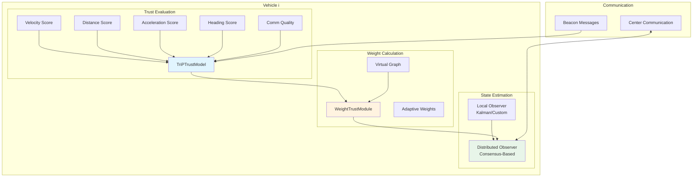
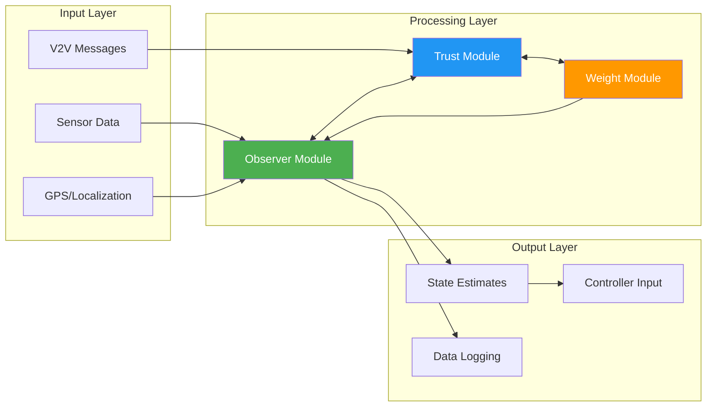
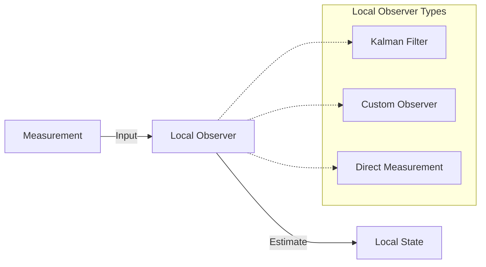
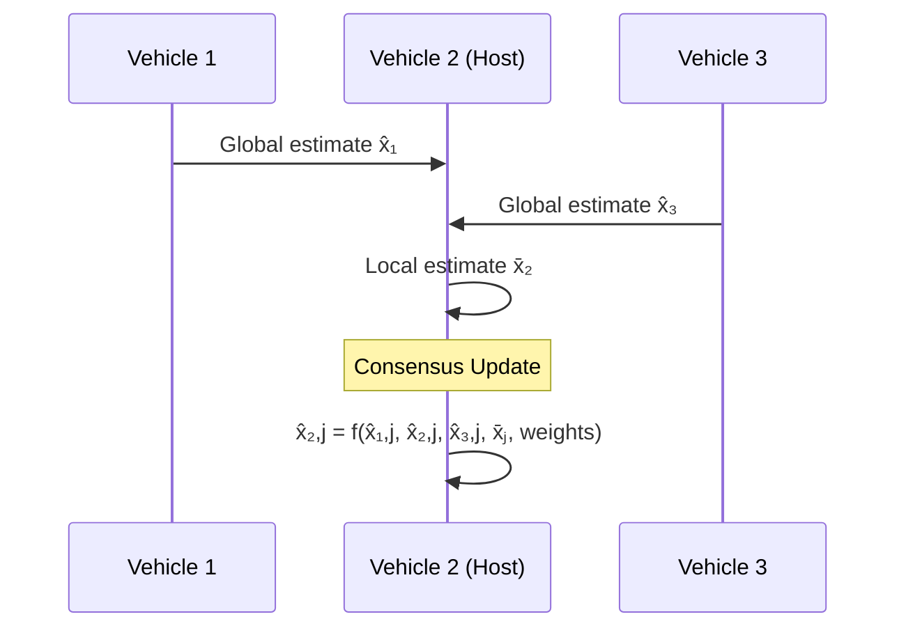
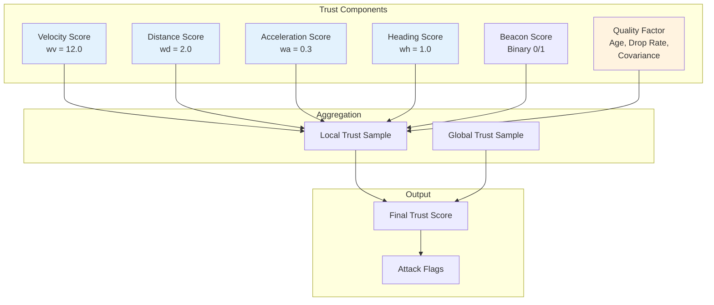
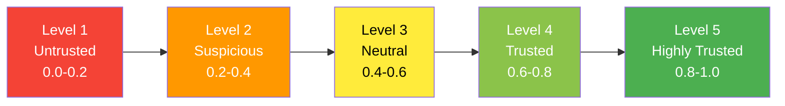
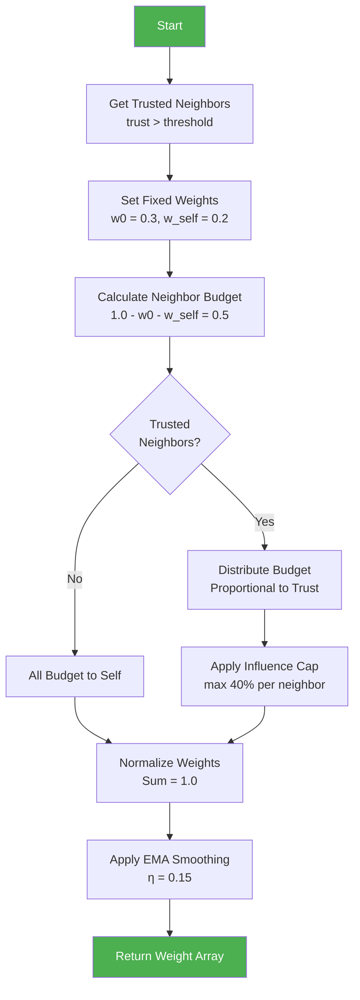
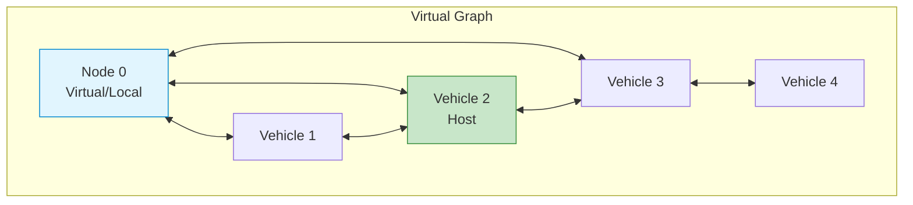
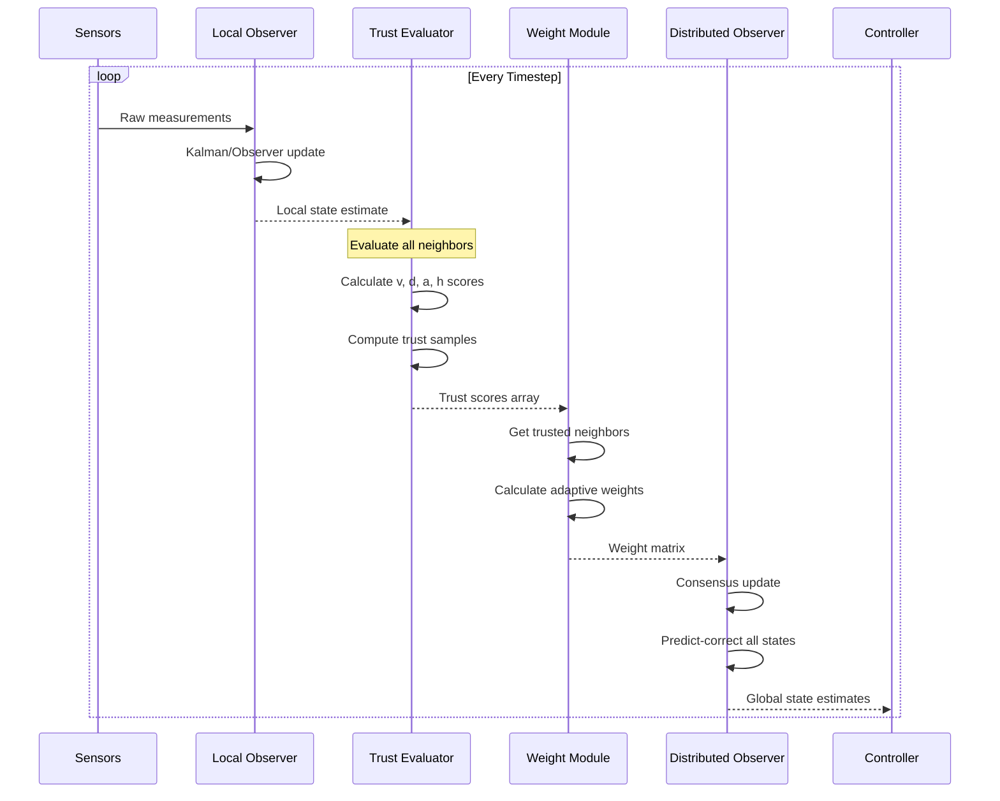

# 🚗 Fleet Framework: Distributed Observer with Trust-Based Adaptive Weights

> **A robust framework for cooperative vehicle state estimation in adversarial environments**

[](https://python.org)
[](https://numpy.org)
[](LICENSE)

---

## 📋 Table of Contents

- [Introduction](#-introduction)
- [Key Features](#-key-features)
- [Overall Architecture](#-overall-architecture)
- [Module Documentation](#-module-documentation)
  - [Observer Module](#-observer-module)
  - [Trust Module](#-trust-module)
  - [Weight Module](#-weight-module)
- [Data Flow](#-data-flow)
- [Configuration](#-configuration)
- [Getting Started](#-getting-started)

---

## 🎯 Introduction

The **Fleet Framework** is a sophisticated distributed state estimation system designed for cooperative vehicle platoons operating in potentially adversarial environments. It implements a multi-layered approach combining:

1. **Distributed Observers** - For resilient state estimation across the vehicle fleet
2. **Trust Evaluation** - Using the TriP (Trust-based Intelligent Platoon) model
3. **Adaptive Weight Calculation** - Dynamically adjusting influence based on trust scores

This framework enables vehicles in a platoon to maintain accurate situational awareness even when some vehicles may be compromised, malfunctioning, or experiencing communication issues.

### 🎓 Research Context

This implementation supports research in:
- Cooperative Adaptive Cruise Control (CACC)
- Attack-resilient vehicle platooning
- Distributed consensus algorithms
- Trust management in vehicular networks

---

## ✨ Key Features

| Feature | Description |
|---------|-------------|
| **Distributed State Estimation** | Each vehicle estimates states of all other vehicles using consensus-based observers |
| **Multi-Component Trust Evaluation** | Velocity, distance, acceleration, heading, and communication quality assessment |
| **Adaptive Weight Distribution** | Trust-aware weight allocation with influence capping |
| **Attack Detection** | Anomaly monitoring with sliding window analysis |
| **Kalman Filter Support** | Optional Kalman filtering for local state estimation |
| **EMA Smoothing** | Temporal stability through exponential moving average |
| **Virtual Graph Topology** | Enhanced connectivity modeling for weight calculation |

---

## 🏗 Overall Architecture

The framework follows a modular architecture with three core components working in synergy:



### Architecture Overview



---

## 📦 Module Documentation

### 🔍 Observer Module

**Location:** `src/Observer/`

The Observer module implements distributed state estimation allowing each vehicle to estimate the states of all vehicles in the platoon.

#### Files

| File | Purpose |
|------|---------|
| [`observer.py`](src/Observer/observer.py) | Core distributed observer implementation |
| [`idm_control.py`](src/Observer/idm_control.py) | IDM-based control prediction |

#### Observer Class

The main `Observer` class provides:

```python
class Observer:
    def __init__(self, vehicle, veh_param, initial_global_state, initial_local_state)
    def local_observer(self, mesure_state, instant_index)
    def distributed_observer(self, instant_index, weights)
    def kalman_filter(self, mesure_state)
```

#### Core Concepts

##### Local Observer

Estimates the host vehicle's own state using either:
- **Kalman Filter** - Standard prediction-correction cycle
- **Custom Observer** - Gain-based estimation with configurable L-gain



##### Distributed Observer

Each vehicle maintains estimates of all vehicles using a consensus protocol:

$$\hat{x}_{i,j}^{+} = A \cdot \left( \hat{x}_{i,j} + \sum_{l \in \mathcal{N}_i} w_{il} (\hat{x}_{l,j} - \hat{x}_{i,j}) + w_{i0} (\bar{x}_j - \hat{x}_{i,j}) \right) + B \cdot u_j$$

Where:
- $\hat{x}_{i,j}$ = Vehicle i's estimate of vehicle j's state
- $w_{il}$ = Weight assigned to neighbor l's estimate
- $\bar{x}_j$ = Local measurement of vehicle j
- $A, B$ = System dynamics matrices



---

### 🛡 Trust Module

**Location:** `src/Trust/`

The Trust module implements the **TriP (Trust-based Intelligent Platoon)** model for evaluating the trustworthiness of neighboring vehicles.

#### Files

| File | Purpose |
|------|---------|
| [`TriPTrustModel.py`](src/Trust/TriPTrustModel.py) | Main trust evaluation model |
| [`test_trust_model.py`](src/Trust/test_trust_model.py) | Unit tests for trust model |

#### Trust Evaluation Components

The trust score is computed from multiple independent evaluators:



#### Trust Score Formulas

| Component | Formula | Description |
|-----------|---------|-------------|
| **Velocity** | $v_{score} = \max(1 - \frac{\|v_y - v_{ref}\|}{v_{ref}}, 0)^{w_v}$ | Compares reported velocity to reference |
| **Distance** | $d_{score} = \max(1 - \frac{\|d_y - d_{measured}\|}{d_{measured}}, 0)^{w_d}$ | Validates distance consistency |
| **Acceleration** | $a_{score} = \max(1 - \|d_{add} \cdot \Delta a\|, 0)^{w_a}$ | Checks acceleration dynamics |
| **Heading** | $h_{score} = \max(1 - \frac{\theta_{diff}}{\theta_{max}}, 0)$ | Validates heading from trajectory |
| **Quality** | $q = e^{-2 \cdot age} \cdot (1 - drop\_rate) \cdot \frac{1}{1 + 0.2 \cdot cov}$ | Communication quality penalty |

#### Trust Score Levels

The model maintains a 5-level trust rating vector with Dirichlet-based updates:



#### Attack Detection Flags

The trust model sets diagnostic flags for anomaly detection:

| Flag | Condition | Interpretation |
|------|-----------|----------------|
| `flag_target_attk` | γ_local > 0.5 AND γ_cross < 0.5 | Target may be under attack |
| `flag_glob_est_check` | γ_local < 0.5 AND γ_cross > 0.5 | Global estimate needs verification |
| `flag_local_est_check` | local_trust_sample < 0.5 | Local measurements unreliable |

---

### ⚖️ Weight Module

**Location:** `src/Weight/`

The Weight module calculates adaptive consensus weights based on trust scores and network topology.

#### Files

| File | Purpose |
|------|---------|
| [`Weight_Trust_module.py`](src/Weight/Weight_Trust_module.py) | Trust-based weight calculation |

#### WeightTrustModule Class

```python
class WeightTrustModule:
    def __init__(self, graph, trust_threshold, kappa, vehicle_id)
    def get_trusted_neighbors(self, car_idx, trust_scores)
    def calculate_weights_trust_v2(self, vehicle_index, trust_scores, config)
    def generate_virtual_graph(self, graph, vehicle_index)
```

#### Weight Calculation Algorithm (v2)

The simplified trust-based weight algorithm:



#### Default Configuration

```python
DEFAULT_WEIGHT_CONFIG = {
    'w0_fixed': 0.3,          # Virtual node weight (local measurement)
    'w_self_base': 0.2,       # Self weight
    'w_cap': 0.4,             # Maximum weight per neighbor (40%)
    'kappa': 5,               # Maximum neighbors to consider
    'eta': 0.15,              # EMA smoothing factor
    'enable_smoothing': True  # Enable temporal smoothing
}
```

#### Virtual Graph Construction

The module creates a virtual graph by adding an extra node (node 0) representing the local measurement:



---

## 🔄 Data Flow

Complete data flow through the framework:



---

## ⚙️ Configuration

### Observer Configuration

```yaml
# In scenarios_config
Local_observer_type: "kalman"  # Options: "kalman", "observer", "direct"
Is_noise_measurement: true
Use_predict_observer: true
predict_controller_type: "self"  # Options: "self", "true_other", "predict_other"
```

### Trust Configuration

```yaml
# Trust thresholds
trust_threshold: 0.5

# Monitoring options
Monitor_sudden_change: true
Dirichlet_type: "Dual"  # Options: "Single", "Dual"
```

### Weight Configuration

```python
config = {
    'w0_fixed': 0.3,
    'w_self_base': 0.2,
    'w_cap': 0.4,
    'kappa': 5,
    'eta': 0.15,
    'enable_smoothing': True
}
```

---

## 🚀 Getting Started

### Prerequisites

```bash
pip install numpy scipy
```

### Basic Usage

```python
from src.Observer.observer import Observer
from src.Trust.TriPTrustModel import TriPTrustModel
from src.Weight.Weight_Trust_module import WeightTrustModule

# Initialize components
trust_model = TriPTrustModel()
weight_module = WeightTrustModule(
    graph=adjacency_matrix,
    trust_threshold=0.5,
    kappa=5,
    vehicle_id=vehicle_id
)

# In main loop
for t in range(num_timesteps):
    # Update local observer
    observer.local_observer(measurement, t)
    
    # Evaluate trust for each neighbor
    trust_scores = []
    for neighbor in neighbors:
        score, *_ = trust_model.calculate_trust(
            host_vehicle, neighbor, leader,
            neighbors, is_nearby, t
        )
        trust_scores.append(score)
    
    # Calculate adaptive weights
    result = weight_module.calculate_weights_trust_v2(
        vehicle_index, trust_scores
    )
    weights = result['weights']
    
    # Update distributed observer
    observer.distributed_observer(t, weights)
```

---

## 📚 References

- [TriP Trust Model Paper](docs/)
- [Distributed Observer Design](docs/)
- [Cooperative Vehicle Platooning](docs/)

---

## 📝 License

This project is part of academic research. Please contact the authors for licensing information.

---

*Last updated: January 2026*
