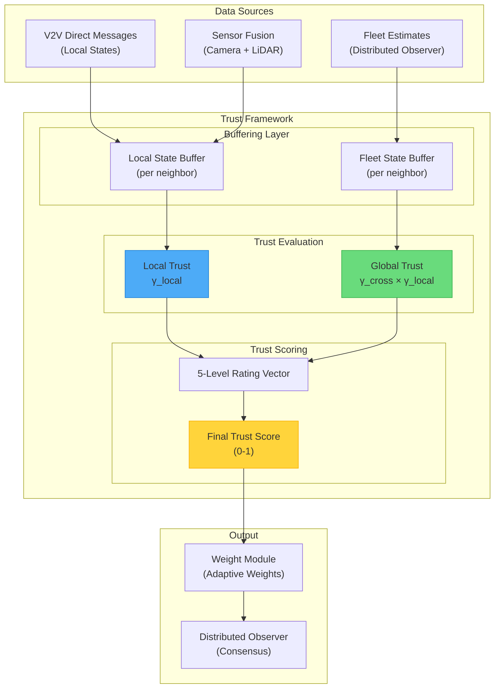
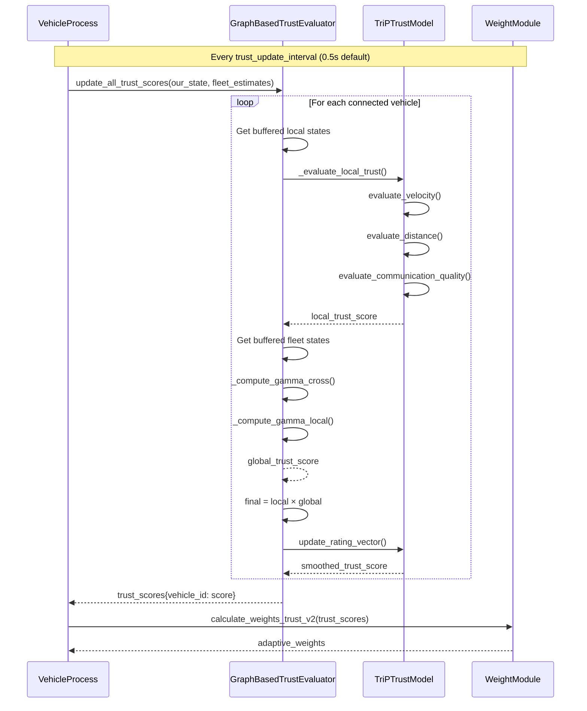
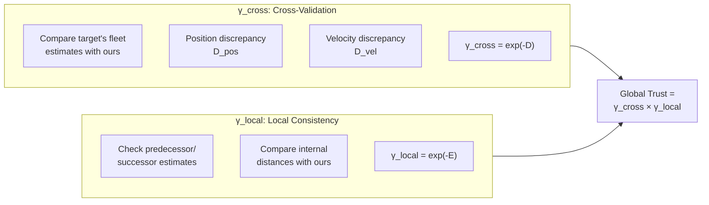
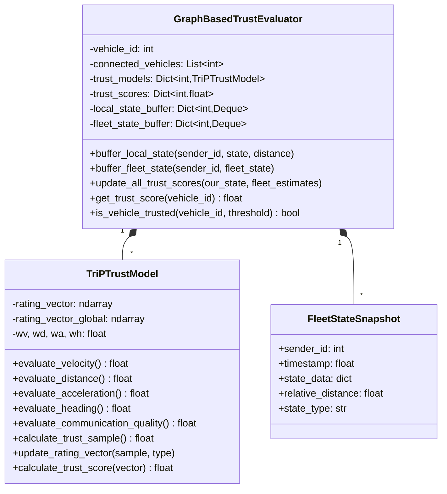

# Trust Framework

**Multi-Layer Trust Evaluation for Secure Vehicle Platoons**

---

## Table of Contents

1. [Introduction](#introduction)
2. [Key Features](#key-features)
3. [Overall Architecture](#overall-architecture)
4. [Trust Evaluation Pipeline](#trust-evaluation-pipeline)
5. [Module Components](#module-components)
6. [Configuration and Integration](#configuration-and-integration)

---

## Introduction

The **Trust Framework** provides a comprehensive multi-layer trust evaluation system for Connected Autonomous Vehicles (CAVs) operating in platoon formations. It protects the distributed observer consensus against malicious or faulty vehicles by continuously evaluating the trustworthiness of received data.

The framework implements a **dual-layer trust model**:

- **Local Trust**: Evaluates direct V2V messages using velocity, distance, acceleration, heading, and beacon metrics
- **Global Trust**: Cross-validates fleet-wide estimates using consistency checks across the distributed observer network

> [!NOTE]
> Trust scores are used by the Weight Module to adaptively adjust consensus weights, reducing the influence of untrusted vehicles on the distributed observer.

---

## Key Features

| Feature | Description |
|---------|-------------|
| **Dual-Layer Evaluation** | Combines local and global trust for robust assessment |
| **Buffered Processing** | Efficient batch processing with configurable intervals |
| **5-Level Rating Vector** | Dirichlet-based trust score smoothing |
| **Anomaly Detection** | Sliding window monitoring for sudden changes |
| **Quality Metrics Integration** | Incorporates communication quality into trust |
| **Graph-Based Topology** | Evaluates only connected neighbors (from fleet graph) |
| **Attack Detection Flags** | Identifies targeted attacks vs. global inconsistencies |

---

## Overall Architecture



### Trust Calculation Flow



---

## Trust Evaluation Pipeline

### Local Trust Components

| Component | Method | Description | Weight |
|-----------|--------|-------------|--------|
| **Velocity** | `evaluate_velocity()` | Compares reported vs expected velocity | wv=12.0 |
| **Distance** | `evaluate_distance()` | Validates reported vs measured distance | wd=2.0 (8.0 nearby) |
| **Acceleration** | `evaluate_acceleration()` | Checks acceleration consistency | wa=0.3 |
| **Heading** | `evaluate_heading()` | Validates heading from position delta | wh=1.0 |
| **Beacon** | `evaluate_beacon_timeout()` | Checks message reception | 0 or 1 |
| **Quality** | `evaluate_communication_quality()` | Message age, drop rate, covariance | Multiplicative |

### Global Trust Components



### Trust Score Calculation

The rating vector uses a **Dirichlet-based smoothing** approach:

```
S_y = (rating_vector + C/k) / (C + Σ rating_vector)
trust_score = Σ weights × S_y

where:
  k = 5 (trust levels)
  C = 0.2 (regularization constant)
  weights = [0.01, 0.26, 0.51, 0.76, 1.0]
```

---

## Module Components

### 1. TriPTrustModel.py - Core Trust Model

The foundational trust evaluation engine with:

- **Velocity scoring** with leader/host reference comparison
- **Distance scoring** with relative error calculation
- **Acceleration scoring** with expected dynamics modeling
- **Heading scoring** using position-based estimation
- **Communication quality** factor for message freshness and reliability
- **Rating vector** management with exponential decay
- **Anomaly detection** with sliding window monitoring

```python
# Example: Evaluate velocity trust
v_score = trust_model.evaluate_velocity(
    host_id=1, target_id=2,
    v_y=5.2,           # Reported velocity
    v_host=5.0,        # Our velocity
    v_leader=5.1,      # Leader velocity
    a_leader=0.0,      # Leader acceleration
    b_leader=0.0,      # Beacon interval
    is_nearby=True,    # Adjacent vehicle
    tolerance=0.1
)
# Returns: 0.0 - 1.0
```

### 2. GraphBasedTrust.py - Buffered Trust Coordinator

High-level trust management with:

- **State buffering** using `deque` with configurable max size
- **Periodic evaluation** at configurable intervals (default 0.5s)
- **Local trust** evaluation from direct V2V messages
- **Global trust** evaluation from fleet estimate comparisons
- **Quality metrics** integration from VehicleProcess
- **Trust-based control** adjustments (e.g., following distance)

```python
# Example: Initialize trust evaluator
trust_evaluator = GraphBasedTrustEvaluator(
    vehicle_id=1,
    connected_vehicles=[0, 2, 3],
    trust_models={0: TriPTrustModel(), 2: TriPTrustModel(), 3: TriPTrustModel()},
    trust_update_interval=0.5,  # Update every 0.5 seconds
    max_buffer_size=20          # Keep last 20 samples
)
```

### Class Diagram



---

## Configuration and Integration

### Trust Parameters

| Parameter | Default | Description |
|-----------|---------|-------------|
| `trust_update_interval` | 0.5s | Time between trust calculations |
| `max_buffer_size` | 20 | Samples per neighbor to buffer |
| `trust_threshold` | 0.5 | Minimum trust for weight inclusion |
| `wv` | 12.0 | Velocity weight |
| `wd` | 2.0 | Distance weight (8.0 for nearby) |
| `wa` | 0.3 | Acceleration weight |
| `wh` | 1.0 | Heading weight |
| `wt` | 0.1 | Local trust decay |
| `wt_global` | 0.5 | Global trust decay |

### Integration with VehicleProcess

```python
# 1. Initialize in __init__
if self.trust_enabled:
    self.trust_evaluator = GraphBasedTrustEvaluator(
        vehicle_id=self.vehicle_id,
        connected_vehicles=self.connected_vehicles,
        trust_models={vid: TriPTrustModel() for vid in connected_vehicles},
        trust_update_interval=0.5,
        max_buffer_size=20
    )

# 2. Buffer states when received
self.trust_evaluator.buffer_local_state(sender_id, state, distance)

# 3. Periodic update in main loop
if self.trust_evaluator.should_update_trust(current_time):
    self.trust_evaluator.update_all_trust_scores(
        our_local_state=self.get_best_available_state(),
        our_fleet_estimates=self.get_fleet_estimates(),
        logger=self.trust_logger
    )

# 4. Get trust scores for weight calculation
trust_scores = self.trust_evaluator.get_all_trust_scores()
```

---

## Related Documentation

- [Weight Module README](../Weight/WeightModule_README.md) - Adaptive weight calculation using trust
- [Attack Module README](../Attack/AttackModule_README.md) - Attack simulation for testing
- [Observer System README](../Observer/README.md) - Distributed observer integration

---

*Last Updated: January 2026*
