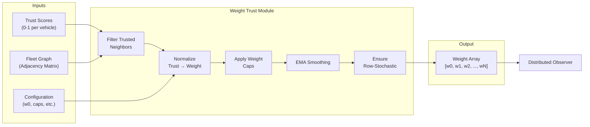
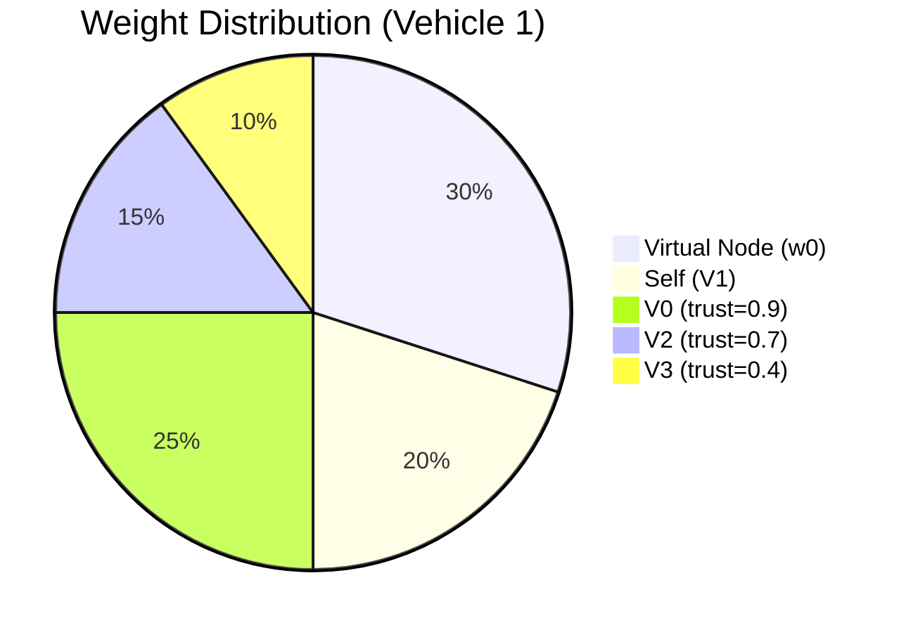
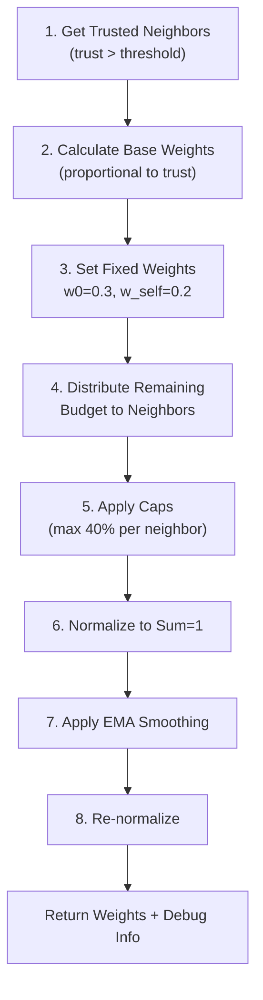
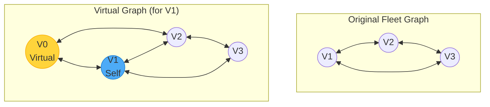

# Weight Module

**Trust-Based Adaptive Weights for Distributed Observer Consensus**

---

## Table of Contents

1. [Introduction](#introduction)
2. [Key Features](#key-features)
3. [Overall Architecture](#overall-architecture)
4. [Weight Calculation Methods](#weight-calculation-methods)
5. [Configuration](#configuration)
6. [Integration Guide](#integration-guide)

---

## Introduction

The **Weight Module** transforms trust scores from the Trust Framework into adaptive consensus weights for the distributed observer. By dynamically adjusting how much influence each neighbor has on state estimation, the system can mitigate the impact of compromised or faulty vehicles while maintaining accurate fleet-wide state awareness.

The module implements a **trust-proportional weight distribution** with safety caps and temporal smoothing to ensure stable and secure consensus.

> [!IMPORTANT]
> Vehicles with trust scores below the threshold are excluded from weight calculation, effectively isolating potentially malicious nodes from the consensus process.

---

## Key Features

| Feature | Description |
|---------|-------------|
| **Trust-Proportional Weights** | Higher trust → higher consensus influence |
| **Influence Capping** | Maximum 40% weight per neighbor |
| **Virtual Node Support** | Fixed weight for local prediction |
| **EMA Smoothing** | Temporal stability for weight transitions |
| **Row-Stochastic Guarantee** | Weights always sum to 1.0 |
| **Topology-Aware** | Respects fleet graph adjacency |

---

## Overall Architecture



### Weight Distribution Example



---

## Weight Calculation Methods

### Method 1: Default Equal Weights

Used when trust is disabled or as fallback:

```python
# Equal weight distribution based on graph topology
weights_dis = calculate_weights_default(vehicle_index)
# w_i = 1 / (degree + 1) for all neighbors and self
```

### Method 2: Trust-Based Weights (V1)

Simple trust-proportional weighting:

```python
weights_dis = calculate_weights_trust(
    vehicle_index=0,
    trust_scores=[1.0, 0.9, 0.7, 0.4],
    weight_type="local"  # or "distributed"
)
```

### Method 3: Trust-Based Weights V2 (Recommended)

Advanced algorithm with all features:



```python
result = weight_module.calculate_weights_trust_v2(
    vehicle_index=0,
    trust_scores=[1.0, 0.9, 0.7, 0.4],
    config=DEFAULT_WEIGHT_CONFIG
)

weights = result['weights']           # Shape: (1, N+1)
trusted = result['trusted_neighbors'] # [1, 2] (indices)
debug = result['debug_info']          # Intermediate values
```

---

## Configuration

### Default Weight Configuration

```python
DEFAULT_WEIGHT_CONFIG = {
    # Fixed weights
    'w0_fixed': 0.3,       # Virtual node (local prediction)
    'w_self_base': 0.2,    # Self weight
    
    # Safety limits
    'w_cap': 0.4,          # Max weight per neighbor (40%)
    'kappa': 5,            # Max neighbors to consider
    
    # Temporal smoothing
    'eta': 0.15,           # EMA factor (0=no change, 1=instant)
    'enable_smoothing': True
}
```

### Configuration Parameters

| Parameter | Default | Description |
|-----------|---------|-------------|
| `w0_fixed` | 0.3 | Virtual node weight (local estimate) |
| `w_self_base` | 0.2 | Self observation weight |
| `w_cap` | 0.4 | Maximum neighbor influence |
| `kappa` | 5 | Maximum neighbors |
| `eta` | 0.15 | EMA smoothing factor |
| `trust_threshold` | 0.5 | Minimum trust for inclusion |

### Weight Budget Allocation

```
Total Budget = 1.0
├── Virtual Node: 0.3 (fixed)
├── Self: 0.2 (fixed)
└── Neighbors: 0.5 (distributed by trust)
    ├── V2 (trust=0.9): 0.25 (capped at 0.4)
    ├── V3 (trust=0.7): 0.15
    └── V4 (trust=0.6): 0.10
```

---

## Integration Guide

### 1. Initialization

```python
from src.Weight.Weight_Trust_module import WeightTrustModule

# In VehicleProcess.__init__
if self.trust_enabled and self.fleet_size > 1:
    self.weight_trust_module = WeightTrustModule(
        graph=self.fleet_graph,
        trust_threshold=0.5,
        kappa=5,
        vehicle_id=self.vehicle_id
    )
```

### 2. Calculate Weights

```python
# In observer update cycle
trust_scores = self.trust_evaluator.get_all_trust_scores()

# Convert to array format
trust_array = np.ones(self.fleet_size)
for vid, score in trust_scores.items():
    trust_array[vid] = score

# Get adaptive weights
result = self.weight_trust_module.calculate_weights_trust_v2(
    vehicle_index=self.vehicle_id,
    trust_scores=trust_array,
    config=None  # Uses defaults
)

weights = result['weights']  # Use in distributed observer
```

### 3. Apply to Distributed Observer

```python
# In VehicleObserver distributed update
def update_distributed_estimates(self, control_input, local_state, timestamp):
    if self.weight_mode == 'trust' and self.weight_trust_module:
        # Get trust-based weights
        trust_scores = self._get_trust_scores_from_process()
        result = self.weight_trust_module.calculate_weights_trust_v2(
            self.vehicle_id, trust_scores
        )
        weights = result['weights']
    else:
        # Use equal weights
        weights = self.weight_trust_module.calculate_weights_default(
            self.vehicle_id
        )
    
    # Apply weights in consensus
    new_estimate = weights @ neighbor_estimates
```

---

## Virtual Graph Concept

The weight module extends the fleet graph with a **virtual node** (node 0) representing the vehicle's local prediction:



The virtual node is connected to the host vehicle and all its neighbors, allowing the consensus algorithm to incorporate the local prediction with a fixed weight.

---

## Related Documentation

- [Trust Framework README](../Trust/TrustFramework_README.md) - Trust evaluation system
- [Attack Module README](../Attack/AttackModule_README.md) - Attack simulation
- [Observer System README](../Observer/README.md) - Distributed observer

---

*Last Updated: January 2026*
