## About

This repository is originally the development environment for ACC Competition 2025. On Ubuntu 24.04, you can move this directory to ```/home/$USER/Documents``` and rename it to ```ACC_Development```. Once relocated and renamed, it'll function as such.

## Setup development container 

Copy file ```.isaac_ros_common-config-quanser``` in ```docker/isaac_ros/config/``` to ```isaac_ros_common/scripts``` and rename it to ```.isaac_ros_common-config```

## Clone repository :
```bash
git clone --recurse-submodules https://<your-personal-access-token>@github.com/vietcxhn/qcar2.git
```

## Development strategy : Trunk-based development
- All work is merged into ```main``` branch.
- Break into small tasks and work on each task on short-lived feature branches (1 to 2 days max).
- Open a Pull Request to ```main```.

## Development guide :

### 1. Create a task (issue)
    
Define the task by creating a new issue in GitHub.

1. Go to projects

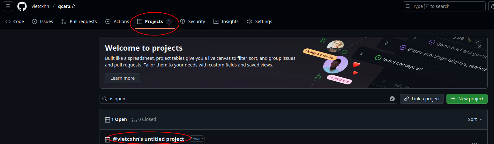

2. Create a task

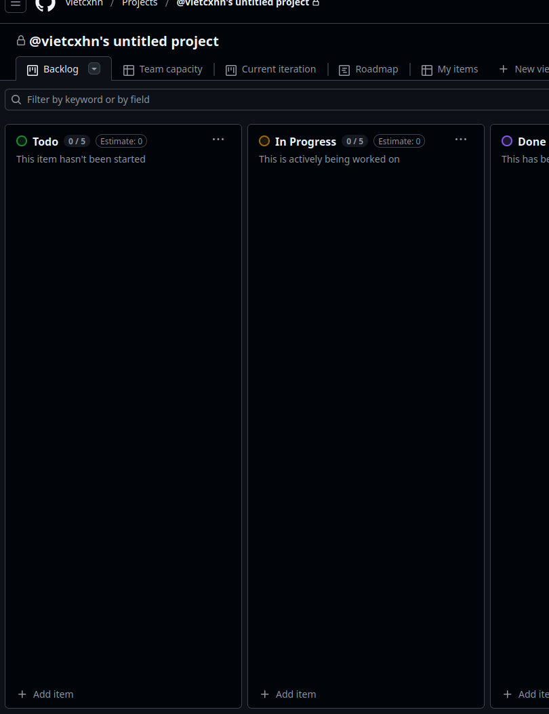

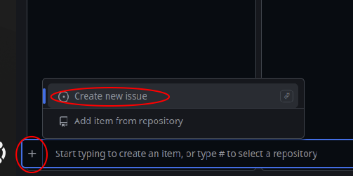

Select the correct repository and create from scratch.

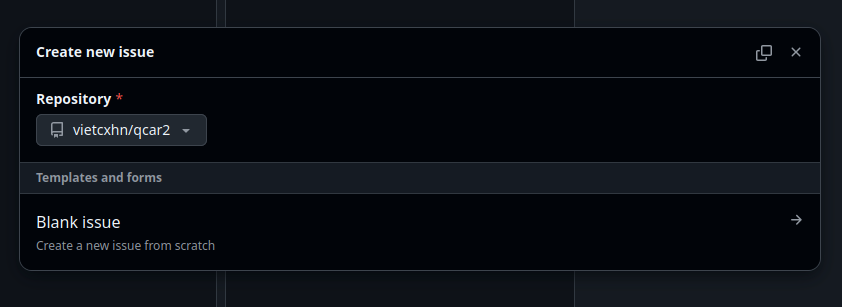

Set a title for your task then Create.

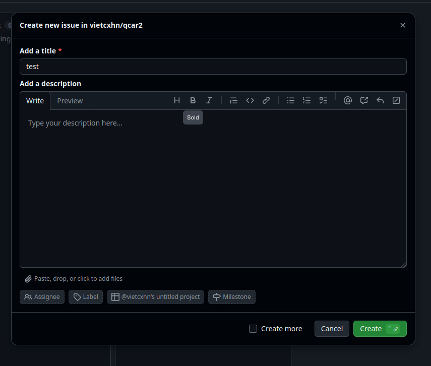

3. Assign yourself to the task

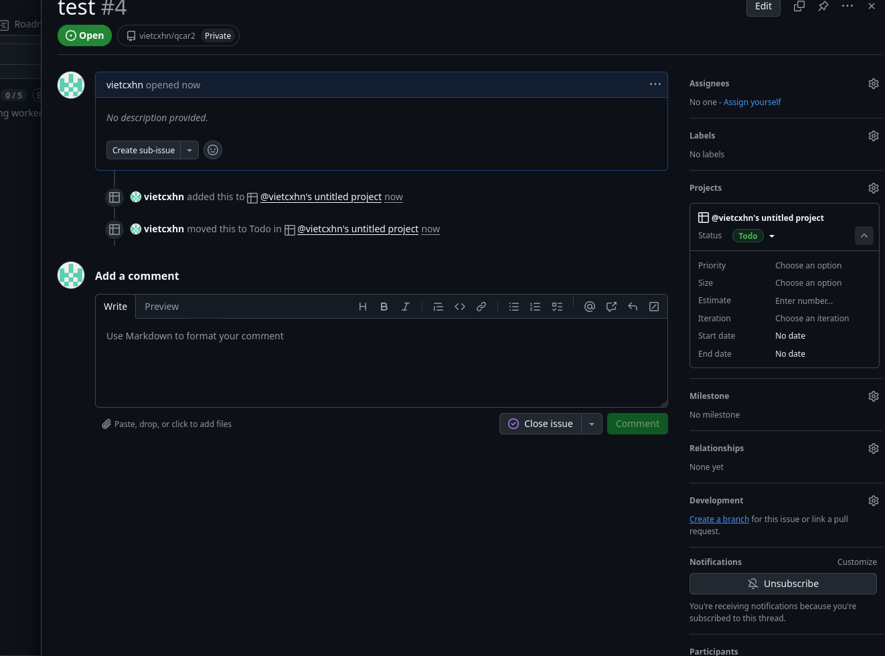

### 2. Create a branch to work on 

Start a short-lived feature branch from ```main```.

1. Create a branch


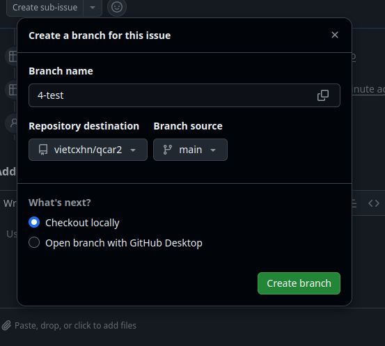

Once you've created a branch, open a terminal in the repository directory and run the provided command to checkout locally.

### 3. Work on the task and push to remote

Make your changes and commit regularly. Push your changes to the remote.

1. Move the task to ```In Progress``` column

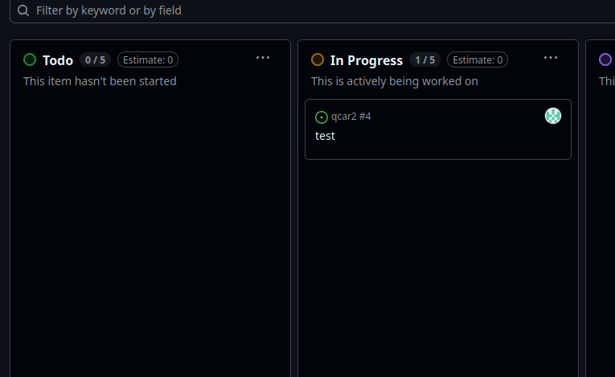

2. Make the changes, stage changes and then commit

Ex : add 2 more lines at the end of the file ```docker/virtual_qcar2/python/Base_Scenarios_Python/Setup_Real_Scenario_Interleaved.py```

To stage changes, click the + icon next to each file under the ```Changes``` section, or click the + next to ```Changes``` to stage all files at once.

Add a commit message and then commit.

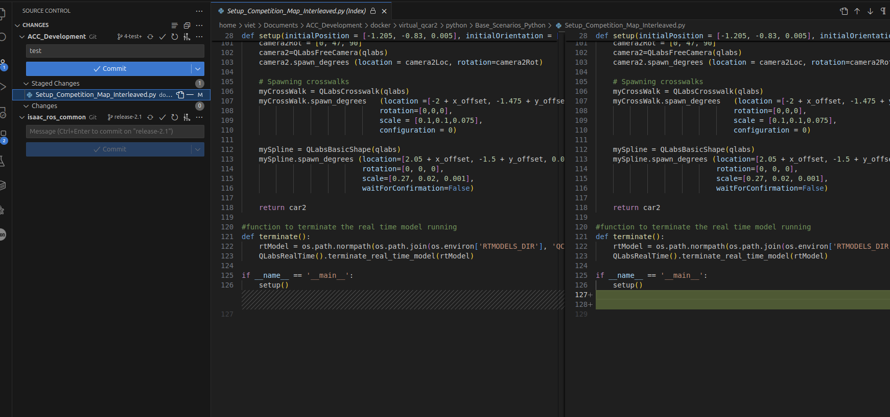

3. Push your changes to remote

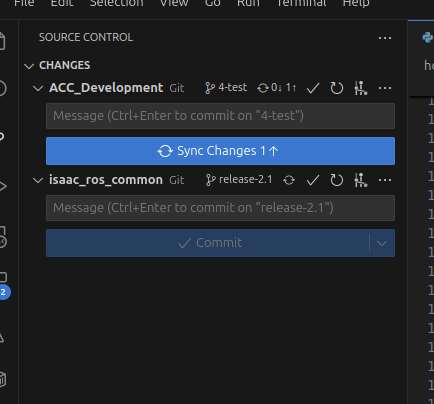

### 4. Open a pull request

Submit a pull request to merge your branch into ```main```.

1. Create a Pull Request

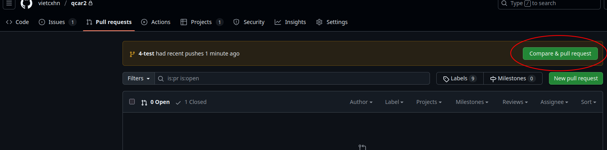

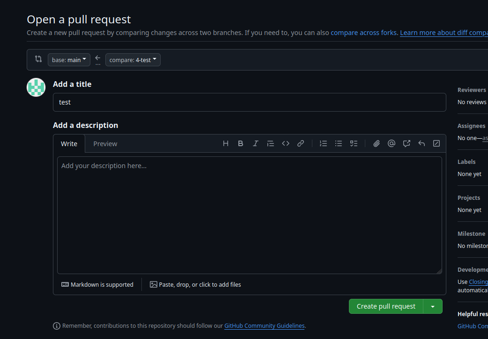

2. Start merging (if there're no conflicts)

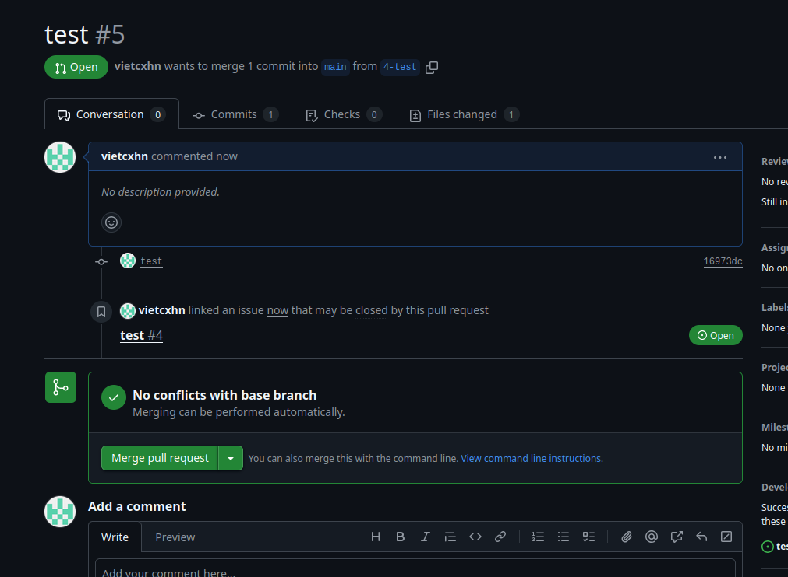

After merging, your task will be moved automatically to ```Done``` column.

3. Delete branch

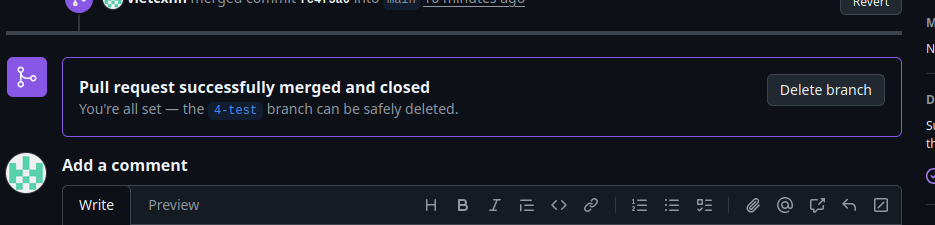
